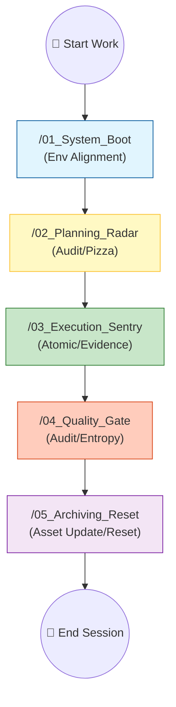

# 🏁 Sentinel-K Project Quick Start (Standard Operating Procedure)

> **Sentinel-K**: A "collaborative operating system" specifically designed for highly efficient AI-human collaboration.

---

## 🏗️ Architecture Layers (Project Layers)

1.  **🚀 Automation Layer (Logic)**: `.agent/workflows/` (AI Execution Instruction Set)
2.  **🧠 Knowledge Layer (Kernel)**: `Sentinel-K_Kernel/` (Single Authoritative Source and Intent)
3.  **🏗️ Execution Layer (Body)**: `Project_Name/` (Specific Business Source Code)
4.  **🗄️ Archive Layer (Archive)**: `docs/` (Prototype Factory and Historical Assets)

---

## 🚀 Minimal Boot Path (Getting Started)

For beginners, we provide a minimal path of **"Inheritance and Injection"**:

### Scenario A: Greenfield Development (From 0 to 1)
| Step                | Operation Type  | File                                | Purpose                                                             |
| :------------------ | :-------------- | :---------------------------------- | :------------------------------------------------------------------ |
| **1. Inject Soul**  | **🔴 Mandatory** | `Sentinel-K_Kernel/01_Landscape.md` | Tell AI your tech stack, business goals, and current pain points.   |
| **2. Inherit Laws** | **🟢 Default**   | `Sentinel-K_Kernel/00_Kernel.md`    | **Directly adopt**. Follow core laws like `[K-PIZZA]`, `[K-LANG]`.  |
| **3. Refine Specs** | **⚪ Optional**  | `Sentinel-K_Kernel/02_Specs/`       | If there are specific naming or habit requirements, add them here.  |
| **4. Activate Env** | **⚡ Run**       | `/01_System_Boot`                   | Load Pack according to `[K-BOOT]`, complete environment self-check. |

### Scenario B: Secondary Development Based on Base Project
*   **Key Updates**: Refine the "Current Milestone" and "Known Issues" in `01_Landscape.md`.
*   **Knowledge Solidification**: Record specific pitfalls of the Base project in `04_FAQ.md` to prevent AI from falling into them again.

---

## 🔄 Development Collaboration Workflow

---

## 📚 Kernel Documentation Collaboration Guide

| Document Name       | Anchor     | Human (Commander)                 | AI (Agent)                                  |
| :------------------ | :--------- | :-------------------------------- | :------------------------------------------ |
| **00_Kernel.md**    | `[K-TERM]` | Audit values/red lines            | Strictly follow core guidelines             |
| **01_Landscape.md** | -          | **Update business blueprint**     | Identify module dependencies & Solid assets |
| **03_ADR.md**       | `[K-ADR]`  | Final sign-off                    | Draft ADR and request review                |
| **04_FAQ.md**       | -          | Provide clues to difficult issues | **Automatically accumulate tech insights**  |
| **05_Tasks.md**     | -          | Break down large tasks            | **Real-time feedback on small steps**       |

---

## 🛠️ Commander Quick Start
1.  **Wake up AI**: Speak commands directly to it (e.g., `Run /01_System_Boot`).
2.  **Check Score**: Pay attention to the **Confidence Score Card**. According to the `[K-PIZZA]` rule, complex tasks must be broken down.
