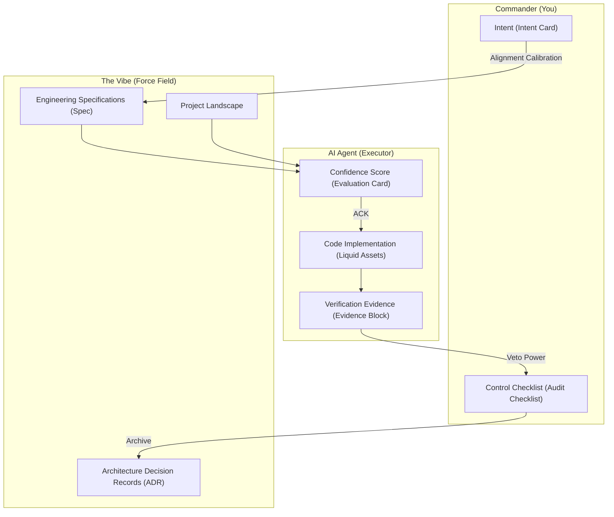
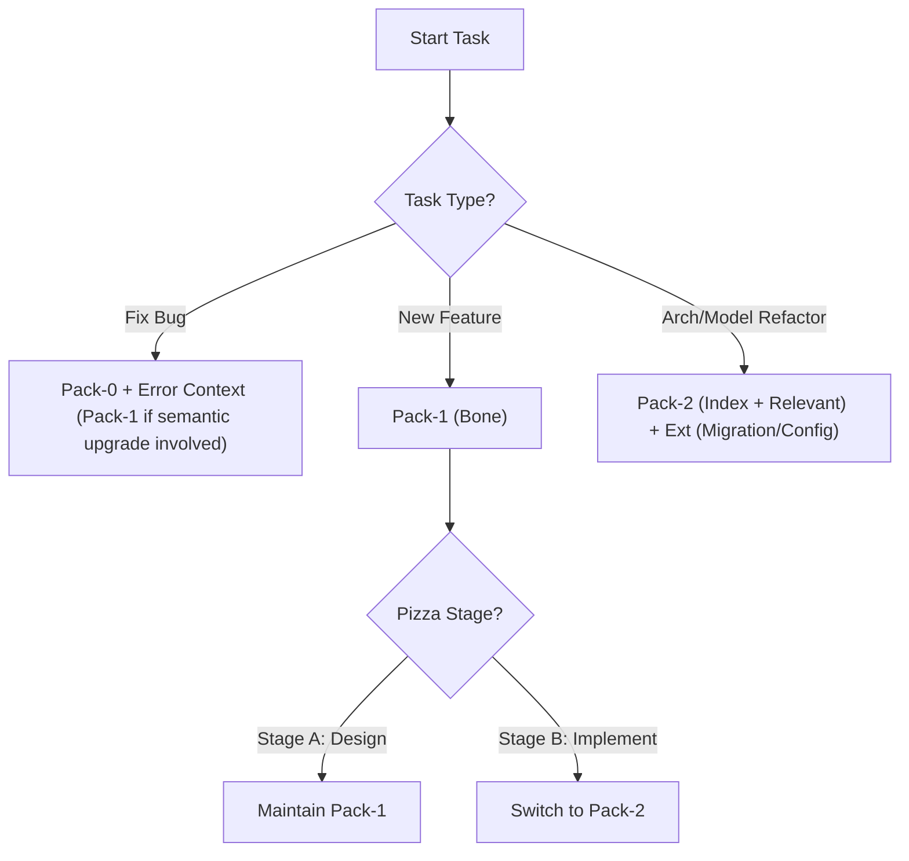
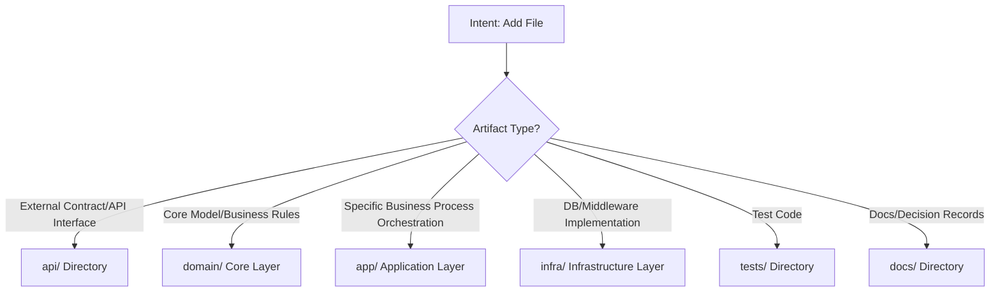

# 📔 Sentinel-K Development Manual (V1.0)

> **Core Goal**: Build high-quality software engineering in the AI-native era through "Intent-Driven" and "Controlled Execution".
> **Document Scale**: In-depth practical guide (expected to be around 50 pages).
> **Maintainers**: Commander & Antigravity AI

---

## <a name="preface"></a>🧊 Ice-breaking Preface: Written for Developers Trapped in "AI Hallucinations"

> [!TIP]
> **🚀 Official Resources and Video Tutorials**
> All workflow scripts (Workflows), `.cursorrules` configuration files, and accompanying resources mentioned in this manual are open-sourced in the official GitHub repository: **[zhaozhendong0608/Sentinel-K](https://github.com/zhaozhendong0608/Sentinel-K)**.
> It is recommended to read this book while following the **recorded instructional videos** updated periodically in the repository for the best practical effect!

**If you are using Cursor, Windsurf, or GitHub Copilot, you must have experienced these frustrating moments:**

1. **"The Bottomless Pit of Messy Edits"**: You just wanted AI to add a pagination bar to the product list. As a result, not only did it add pagination, but it also conveniently deleted the previously written permission interceptor and introduced 3 new errors.
2. **"The Uninheritable Legacy"**: Yesterday you spent 2 hours clarifying a specific billing logic with AI. Today you opened a new chat box, and as if it had amnesia, it wrote completely non-compliant code for you again.
3. **"The Fear of Merging"**: AI rapidly generated 500 lines of code and told you "It's done, just run it!". But looking at the dense changes, you dare not commit the code at all. You don't even know if it quietly touched the database core models.

This is not your fault, nor is it necessarily a lack of capability in AI Large Language Models (LLMs). The core problem is——**we are leading AI the wrong way.**
In the past, we treated ourselves as AI's "coaches", trying to teach it how to write code line by line in the chat box; this is like sitting in the cockpit pulling the steering wheel to teach an airplane how to fly. This inevitably leads to context pollution and hallucination disasters.

**"Sentinel-K Intent-Driven Engineering" is your antidote.**
It doesn't teach you fancy Prompt tricks. It is a **Standard Operating Procedure (SOP)** refined from engineering practices of major tech companies.
Its core philosophy is simple: **"Transform code generation into deterministic software delivery"**.
No more black boxes, no more guessing. By establishing mandatory safety guardrails (Asset Control), task breakdown systems (Pizza Slicing), and immutable evidence chains (Evidence), we will make you truly become the **"Software Commander"** who masters the machine.


> [!WARNING]
> **⚠️ [Reading Warning: Please confirm first if this is for you]**
>
> Not every developer needs Sentinel-K. To avoid wasting your time, please verify:
> 
> **🎯 This is prepared for you, if:**
> - You are a Tech Lead, urgently needing engineering specifications to control the flooding "AI inferior code" in your team.
> - You are a heavy Cursor player, troubled by AI forgetting context or fixing A but breaking B, longing to break through the "single-player development bottleneck".
> - You want to evolve from a "typist" tapping code to a "Software Commander" who only makes decisions and accepts deliverables.
> 
> **🚫 It is strongly recommended that you close this document immediately, if:**
> - **You are a zero-foundation beginner**: System design and code aesthetics are irreplaceable. If you cannot judge good code from bad, you will be unable to accept the "evidence" provided by the large model.
> - **You are a believer in "One-Click Generation"**: If you fantasize about generating a whole application with a single Prompt, there is no magic here, only the high pressure and discipline of industrial flow.
> - **You only write small toy scripts of a hundred lines**: Using a cruise missile to hit a mosquito will only increase your burden.

---

## <a name="case-study"></a>⚔️ Pre-class Combat: A Tragedy Caused by a Simple "Add Cache" Requirement

To let you intuitively understand the power of Sentinel-K, let's look at a real development scenario:

> **Requirement Background**: In a common e-commerce project based on frameworks like Spring Boot/NodeJS, you need to add Redis Cache functionality to the already written "get product details" interface.

### ❌ Reproducing a Typical Tragedy: Being Led by AI's Rhythm

You open Cursor/Claude and enter the command like this:
*"Add redis cache logic to the `getProductInfo` method in `ProductService`, set expiration to 5 minutes."*

AI very actively spits out code within 5 seconds:
```java
// Oops, for convenience, AI directly imported RedisTemplate here,
// and quietly refactored some "inelegant" query parameter validation logic.
// It even forgot to handle the exception where the inventory product is taken off shelves...
```
**Result**: In order to fix the parameters and exception handling it quietly messed up, you spent another half an hour wrestling with it. This is a typical requirement pollution! **You have lost control of the code.**

### ✅ Sentinel-K's Solution: Controlled Execution and Atomic Slicing

If we use the Sentinel-K specification, your operations will be a dimensionality-reduction calmness:

**Step 1: Launch Detection Radar (Planning)**
You will not let AI directly "modify the service layer". At this stage, you need to treat it as your "Staff Officer", sending the following Prompt:
> 💡 *[Copy this to send to AI]* 
> "Start in Sentinel-K mode. The goal is to add Redis cache to product details, 5 minutes expiration. **Do not write code yet!** First, do a Requirement Radar scan (Radar) to evaluate which asset structures this will touch? And list your suggested slicing (Pizza Slice) plan."

After detection, AI will report (producing planning artifacts):
*"Detected need to introduce Redis dependency, belongs to core infrastructure component changes (Solid-Strict touched) -> Needs to generate Architecture Decision Record (ADR).*
*Suggest splitting the task into two slices:*
*S1 (Bone Slice): Do not modify logic, only introduce Redis config classes and Cache interface definitions.*
*S2 (Muscle Slice): Inject interface dependency implementation into the original `ProductService`."*

**Step 2: Demand Absolute Evidence (Evidence)**
When executing S2, you will not allow it to directly apply the patch, but command it to provide unforgeable "modification evidence":
> 💡 *[Copy this to send to AI]* 
> "The thought process is fine. Now start executing S2. After execution, **you must output the Verification Evidence block and provide the log screenshot/text of the local passing unit tests**, wait for my confirmation (ACK)."

AI won't dare to lie; it must generate a structured review report to ask for your permission:
*"Evidence: Modified `ProductService.java` (+12 additions, -0 deletions). Core entity rules untouched. Local test `ProductSuite` passed (Green Light). Requesting Commander ACK (Authorize Merge)."*

This is the charm of Sentinel-K: **All processes are highly predictable; it can no longer sneakily cause damage when you are not paying attention. Only when you finish checking the "Evidence" and reply `ACK`, will the changes truly hit the disk.**

Are you ready? Turn to the next page, let's formally build your "Commander System" in the silicon-based era.

---

## <a name="quick-start"></a>⚡ 3-Minute Quick Start Guide
If this is your first time encountering Sentinel-K and you feel overwhelmed by the tens of thousands of words in the manual, **don't panic**. You only need to remember and practice the following three core steps first, which will filter out 80% of disasters caused by AI hallucinations.

### Core 1: Always Issue Requirements in "Two Steps"

Do not ask AI to "generate all code" at once. Treat all daily development as a two-phase reconnaissance mission.

1. **Ask for "Thought Process" First**: "I plan to build feature X, please scan (Radar) first, which core files will this touch? How many reliable steps should it be broken down into?"

2. **Give "Authorization" Later**: "Thought process is correct, execute the first step (S1) as you said. Show me the Diff after completion, then I will decide whether to proceed."

### Core 2: Demand a "Witness"

When AI says "I'm done writing", never believe it. Force it to present objective evidence that it "has finished writing and has no side effects". The simplest asking template:
> "I received the code. Now please execute local automated tests, paste the final green output logs and modified file line counts here for my review (issue the Evidence report)."

### Core 3: Protect Your "Solid Assets" (Solid-Strict)

Database Entity models, core auth middleware, global config files, these are all **Solid Assets**. For these three things, try to hand-write or personally review them, **resolutely refusing AI to arbitrarily expand and patch them**. Hand over the remaining logic glue code and frontend pages for it to write.

*Mastering the above three points, you are already a qualified foundational "Software Commander". Next, you can treat this manual as a dictionary, consulting it as needed.*

---

## 🛡️ Battlefield Chronicles: Why Can We Entrust Our Lives to This Specification?

Before launching Sentinel-K, we were almost tortured to the point of collapse by AI in our own internal commercial projects. During three months of high-pressure development (Jan-Feb 2026), we completely relied on large models.

**Before using this specification (Chaotic Period):**

- ❌ **4 severe "Overwrite Accidents" occurred in one week**: While fixing the UI, AI changed the underlying data authentication logic to `return true`. Due to the lack of Evidence (audit evidence), this directly merged into the main branch, nearly causing a privilege escalation disaster in production.
- ❌ **Extreme wrestling of 40 turns per conversation**: Every time AI forgot the old code, we had to re-feed thousands of lines of files to it, leading to Token blowout, which not only burned money but stalled progress.

**After introducing Sentinel-K (Awakening Period):**

- ✅ **"Fatal Hallucination" Interception Rate increased to 100%**: Based on the "Solid-Strict Redline" and "Merge Must Issue Evidence Test Logs" specs, 30% of the defective code generated by AI was intercepted by automated tests before developers clicked `Accept`, and no unexpected corruption of core logic occurred again.
- ✅ **Zero-Loss "Project Handover"**: Because we mandated the ADR (Decision Log) mechanism, newcomers (even a fresh AI window) only need to use 1 Token request to read the `docs/` directory, and can seamlessly take over a complex iteration task spanning a month within 5 seconds.

This methodology has no magic; it's all **"discipline bought with blood and tears"**.
When you start feeling and enjoying the "absolute sense of control" brought by this discipline, you will understand: **Making programming boring and making design sexy is the best engineering experience in the AI era.**

---

## 🐣 From 0 to 1: How to Start Your First Sentinel-K Native Project?
We talked earlier about how to "quit large model addiction" in old projects, but if you want to experience the ultimate power of this workflow, it is highly recommended you start a **"construction-level native application"** using the official repository:

1. **Clone the Official Base Repo**: Directly pull this open-source repository ([zhaozhendong0608/Sentinel-K](https://github.com/zhaozhendong0608/Sentinel-K)), which itself is the best reference bred and maintained according to Sentinel-K specifications.
2. **Initialize External Brain**: Modify `docs/01_项目全景 (Landscape).md` in the root directory, writing down your product definition (for example: "This is a Todo management system built with Next.js + Tailwind").
3. **Awaken 02_Requirement Radar**: Throw this initial requirement, along with the `/02_需求雷达` (workflow script), to AI, letting it help you break down the one-sentence requirement into "Bone Slices (S1)" and "Muscle Slices (S2)".
4. **Launch 03_Controlled Execution**: Pick out a slice given by the radar, demand AI to execute it, and explicitly require it to issue passed assertion feedback logs as Evidence.
5. **Commit and 05_Archive/Restart**: When you have merged this perfectly green code, record the current progress into the Landscape or ADR, and then **unhesitatingly close the currently messy chat box**. Open a new window, use `/01_启动自检` (Boot Check) to recover sanity, and begin slicing the next pizza.

---

## 🗺️ Universal Outline

### Prologue: Reshaping AI Programming Experience
- **[Ice-breaking Preface: Why You Need "Intent-Driven"](#preface)**
- **[Pre-class Combat: A Tragedy Caused by an "Add Cache" Requirement](#case-study)**
- **[3-Minute Quick Start Guide](#quick-start)**

### Part I: Philosophy —— Cognitive Reshaping
1.  **[Chapter 1: Sentinel-K Intent-Driven Development](#chapter-1)** 🧠
    *   1.1 Chapter Contract
    *   1.2 Applicability & Boundaries
    *   1.3 Defining Vibecoding (Definitions & Score)
    *   1.4 Intent vs Code
    *   1.5 Commander Awareness and Three Major Responsibilities (Role & Evidence)
    *   1.6 Sentry Alerts and Safety Disposal SOP (Safety)
2.  **[Chapter 2: AI-Native Development Laws](#chapter-2)** 🛡️
    *   2.1 The Game between Determinism and Randomness (Principles)
    *   2.2 Pizza Logic: Atomic Task Decomposition
    *   2.3 Reverse Testing SOP
    *   2.4 ADR-Driven and Continuity Protection (ADR & Continuity)
    *   2.5 Practical Quickstart: Atomic Breakthrough of Complex Logic

### Part II: Assets —— Contextual Asset Management 📂
3.  **[Chapter 3: Digital External Brain (The Brain)](#chapter-3)**
    *   3.1 Long-term Memory: Project Landscape (Architecture & Tech Stack)
    *   3.2 Short-term Memory: Task List (Task Lifecycle)
    *   3.3 Legal Deposit: The Immutability of Architecture Decision Records (ADR)
4.  **[Chapter 4: Engineering Structure Specifications —— Order in the Physical World](#chapter-4)** 📂
    *   4.1 Structural Blueprint and Placement Decision Tree
    *   4.2 Asset Grading and Dependency Matrix
    *   4.3 Governance Standards (Configuration, Migration, Contracts)
    *   4.4 Commander Documentation System Standardization
    *   4.5 Structural Anti-patterns and DoD Alignment

### Part III: Workflow —— SOP Standard Process 🏎️
5.  **[Chapter 5: Four-Stage Cognitive Loop](#chapter-5)**
    *   5.1 Stage 1: Requirement Radar (Planning)
    *   5.2 Stage 2: Controlled Execution (Execution)
    *   5.3 Stage 3: Quality Gate (Audit)
    *   5.4 Stage 4: Archive and Restart (Archiving)
    *   5.5 Circuit Breaker Mechanism
6.  **[Chapter 6: Interaction Design and Prototype Driven](#chapter-6)** 🎨
    *   6.1 Why Interaction Logic Beats Code Logic
    *   6.2 SOP for "Plot Rehearsal" using H5 Prototypes

### Part IV: Tools —— Toolchain and Automation 🛠️
7.  **[Chapter 7: Antigravity IDE In-Depth Practice](#chapter-7)** 🛸
    *   7.1 Advanced Usage of Agentic Mode
    *   7.2 Synergy of Smart Artifact Systems
    *   7.3 Collaborative Combat: Terminal, Browser, and Code Generators
8.  **[Chapter 8: Custom Workflow Design](#chapter-8)**
    *   8.1 Prompt as Code: Anatomy of Workflow Files
    *   8.2 Building a Team-Exclusive "Action Library"
    *   8.3 Workflow Bootstrapping and Preset Libraries

### Part V: Practice and Maintenance —— Firefighting and Evolution 🚑
9.  **[Chapter 9: Sentry Interception and Error Recovery](#chapter-9)**
    *   9.1 Circuit Breaker: When Confidence Score is Below 80
    *   9.2 Firefighting Guide: Error Stack Analysis and Extreme Maintenance
    *   9.3 Git Regret Pill: Version Rollback and Decision Auditing
10. **[Chapter 10: Practical Case Studies](#chapter-10)** ⚔️
    *   10.1 The Breakthrough Process of a Complex Operator Orchestration Engine
    *   10.2 Review of 0 to 1 MVP Building Experience
11. **[Chapter 11: Legacy Systems and Team Collaboration](#chapter-11)** 🤝
    *   11.1 Legacy System Onboarding SOP
    *   11.2 Pack Strategy and "Context Probes" in Legacy Mode
    *   11.3 Evidence Credibility: Witnesses and Unforgeable Evidence
    *   11.4 Reverse Testing Reinforcement: Test Locking and Anti-Fraud
    *   11.5 Multi-person Concurrency: ADR Numbering, Asset Locks, and Branch Strategies

### Appendix and Extensions (Endings)
- **[Core Terminology Overview (Glossary)](#glossary)**
- **[High-Frequency Hardcore FAQ](#faq)**
- **[Conclusion: Metamorphosis from Programmer to "Software Commander"](#conclusion)**
- **[Sentinel-K Toolkit (The Toolkit)](#toolkit)**
- **[Join the Barracks (Community)](#community)**
- **[Version Notes and Revision Plan (Roadmap)](#roadmap)**

---

<a name="chapter-1"></a>
## Chapter 1: Core Philosophy —— Sentinel-K Intent-Driven Development 🧠

> **Foreword (Layman's Terms)**
> Why does AI constantly write code that makes you collapse? Why does it always "forget" your requirements?
> This chapter will tell you: AI is not your "employee", but your "weapon". You don't need to learn how to teach it to write code, but instead learn how to **issue correct commands**.

### 1.1 Chapter Contract



#### 1.1.1 Core Authority Assets

To ensure command alignment, the project must possess the following four types of logic assets:

| Logic Asset Name | Core Responsibilities                              | Example Physical Path                             |
| :--------------- | :------------------------------------------------- | :------------------------------------------------ |
| **`Kernel`**     | Meta-specifications for development, SOP standards | `Sentinel-K_内核/00_系统总纲 (Kernel).md`         |
| **`Landscape`**  | Architecture diagram, tech stack, domain model     | `Sentinel-K_内核/01_项目全景 (Landscape).md`      |
| **`Specs`**      | Unified code style, security, exception standards  | `Sentinel-K_内核/02_开发规约 (Specs)/后端规约.md` |
| **`ADR`**        | Architecture decision records, major change logs   | `Sentinel-K_内核/03_决策日志 (ADR).md`            |

> [!TIP]
> **Reference Principle**: It is recommended to quote the "Logical Name" directly. Referencing specific spec entries uniformly adopts the `SPEC#[ID]` (e.g., `SPEC#SECURITY`) or `ADR-[ID]` format.
> **Example Explanation**: The specific file paths (e.g., `Sentinel-K_内核/02_开发规约 (Specs)/`) appearing in this manual are placeholder examples, please map them according to the actual project.

#### 1.3 AI Reading Protocol (Token Optimization) `[K-READ]`
> [!IMPORTANT]
> **AI Reading Red Line**: This manual exceeds 2000 lines (130KB+). It is strictly PROHIBITED for AI to read the whole file to "reference" it.
> 1. **Search Mode**: Prioritize using `grep_search` to locate keywords, or using `view_file_outline` to view chapters.
> 2. **Local Reading**: After finding the precise anchor point, use `view_file` to read the 50 lines before and after the target line.
> 3. **Cache Awareness**: Unless the Commander forces it (e.g., "Full Audit"), a single interaction reading this file MUST NOT exceed 800 lines.

#### 1.1.2 Reader Persona and Deliverables
*   **Reader Persona**: Frontline Engineers (Default Java/Spring context, analogize for other stacks).
*   **Applicable Scenarios**: New feature development / Legacy code refactoring / Complex operator development.
*   **Inapplicable Scenarios**: Highly confidential environments, extreme risk changes requiring 100% manual review without CI/CD verification feedback.
*   **Deliverables**:
    - [ ] **Intent Card**: Align with [Appendix A](#appendix-a).
    - [ ] **Vibe Spec**: Align with [Appendix B](#appendix-b).
    - [ ] **Audit Checklist**: Align with [Appendix C](#appendix-c).
    - [ ] **DoD & Verification**: Align with [Appendix D](#appendix-d).

#### 1.1.3 IDE Context Load Protocol (IDE Context Pack)
For IDE assistants like Cursor / Qoder / Antigravity, the Commander should load context by grades and references:

*   **Pack-0 (Boot Pack)**: `Kernel` + `Specs` + task-affected code entry classes (1-3).
*   **Pack-1 (Execution Pack)**: `Pack-0` + `Landscape` + related submodule directories + Contract Definitions (OpenAPI/DTO).
*   **Pack-2 (Index + Relevant)**: `Pack-1` + `ADR Index + Relevant ADRs` + Database DDL (Migration) + CI/Project config files.

> [!IMPORTANT]
> When the Executor outputs the Confidence Score Card, it MUST explicitly declare the current **Context Pack Level** used and the critical files/symbols included.

---

### 1.2 Applicability & Boundaries

Before entering specific development workflows, the scope of this manual must be clarified.

#### 1.2.1 Role Persona
*   **Commander (You)**: Humans with engineering experience. Responsible for defining boundaries, auditing security, and accepting results.
*   **Agent (Executor)**: AI possessing **reasoning and task decomposition capabilities**. Responsible for deducing logic, generating code, and executing verification tasks.

#### 1.2.2 Applicability Scenarios
*   ✅ **Admitted**: New project 0-1, business module iteration, data conversion operators, boilerplate generation.
*   ⚠️ **Controlled**: Core security algorithms, high-concurrency performance tuning, sensitive fund flow changes.
*   ❌ **Blocked**: Niche domains not covered by model logic, black box environments lacking CI/CD verification.

---

### 1.3 Defining Vibecoding

In the AI-native era, development paradigms have shifted fundamentally from "Process Control" to "Intent-Driven".

#### 1.3.1 Engineering Definition and Judgment
1.  **Intent**: Must contain 5 core elements: **Goal, Scope, Constraints, DoD (Definition of Done), Risk**.
2.  **Vibe**: Must contain: **Directory conventions, dependency whitelists, exception/logging standards, naming conventions**.
3.  **Judgement Signal**: **Confidence Score ≥ 80**.

#### 1.3.2 Confidence Score Evaluation Card
The Executor (AI) must output replies according to the table below. **Each score item must be accompanied by specific Evidence References**.

| Dimension                 | Scoring Basis and Evidence Requirements                                                                           | Weight |
| :------------------------ | :---------------------------------------------------------------------------------------------------------------- | :----- |
| **Context Coverage**      | Whether the correct **Context Pack** was loaded. **Evidence**: Listed loaded file names, symbols or @ references. | 20     |
| **Constraint Restating**  | Internalization of critical `Specs`. **Evidence**: Excerpting specific spec item IDs or core rule snippets.       | 20     |
| **Risk Identification**   | Pointing out potential breakage points. **Evidence**: Path + section title/unique string, symbol name.            | 20     |
| **Solution Completeness** | Covering data/business/interfaces/exceptions. **Evidence**: List of classes, functions, or modules to be added.   | 20     |
| **Executable Path**       | Providing Red/Green (TDD) paths. **Evidence**: Specified test class name/Runner and expected assertion state.     | 20     |

> [!IMPORTANT]
> **Commander's Veto Power**
> 1. **Core Minimums**: If either "Constraint Restating" or "Risk Identification" scores < 10, a **Circuit Break** must be triggered immediately.
> 2. **Evidence Auditing**: The Commander must spot-check the scoring evidence. If the AI hallucinates rules or obfuscates risks, even with a total > 80, the Vibe must be forcefully reset. **It is STRICTLY PROHIBITED to issue an ACK command without verified evidence.**

#### 💡 Golden Standard: A Qualified Confidence Score Output (Example)

### Confidence Score: 90/100
- **Context Coverage (20/20)**: Loaded `Kernel`, `Landscape`, `Specs`.
- **Constraint Restating (20/20)**: Aligned with `SPEC#SECURITY` (Masking) and `SPEC#THROTTLE` (Rate Limiting).
- **Risk Identification (10/20)**: Noticed the old logic of `CORE_SERVICE` does not handle concurrent conflicts; planning to introduce a distributed lock, which might cause 50ms latency latency.
- **Solution Completeness (20/20)**: Planning to add `TRANS_DTO`, `DATA_CONVERTER`, `APP_SERVICE#process_task`.
- **Executable Path (20/20)**: Prepared `TEST_RUNNER` to execute `BUSINESS_CORE_TEST`. Expectation: Logic alignment.


#### 1.3.3 Closed-Loop Metrics and Quality Thresholds (DoD Specs)
To ensure quality delivery, artifacts must pass the following quality gates:
0.  **Evidence Trust**: Any "Green" conclusion must be reviewable; AI mere statements are prohibited.
    *   **Requirement**: Evidence must lead back to "the raw result produced by the machine" (CI artifacts/reports/IDE terminal verbatim).
    *   **Forbidden**: Constructing Run/Scan text by AI hand-coding (LLMs might hallucinate).
1.  **Static Scanning**: **"Blocking level alerts must be 0"**.
    *   **Baseline**: The report must declare the scanner name (e.g., SonarQube, Checkstyle) and ruleset version.
2.  **Automated Testing (Minimum DoD Set)**:
    *   **Layer Principle**: Unit tests for logic layers, Integration/Slice tests for interface layers.
    *   **Regression Strategy**: Changes involving global configs or infrastructure must execute full regression.
    *   **Conclusion**: Must entirely pass (Green).

> [!TIP]
> **Pizza Logic `[K-PIZZA]`**
> When the intent involves changes **> 3 files** or **> 100 lines of code**, atomic decomposition must be forced. See `Kernel` for details.
> - **Experimental/Micro Projects**: Restrictions can be relaxed slightly.
3.  **Manual Auditing**: Core items in the **Audit Checklist** (Security, Architecture Isolation) must be fully checked and signed off.

> [!IMPORTANT]
> **Minimum Evidence Threshold**
> For any delivery entering the "Pass (Green)" stage, its **Verification Evidence Block** must simultaneously contain the following elements. Otherwise, the Commander is **prohibited from executing ACK merge**:
> 1. **Run Result**: Explicit automated test run summary.
> 2. **Scan Result**: Static scanning results with 0 blocking alerts.
> 3. **Diff Preview**: Patch/Diff must be output first for manual reading.
> **Downgrade Rules**: If the project lacks a toolchain, the AI must provide a "Logic double self-check statement" conforming to `SPEC#SECURITY` as compensatory evidence.

---

### 1.4 Intent vs Code
In the Sentinel-K system, understanding the fundamental difference between "Intent" and "Code" is the key determining whether you can be a qualified Commander.

> **Simple Understanding**:
> - **Intent** is the "Goal" (I want to go to Shanghai).
> - **Code** is the "Tool" (Do I drive or take the bullet train).
> Even if the tool breaks (code throws error), as long as the goal (intent) remains, you can always find another way to arrive.

#### Dimensional Comparison Table
| Feature       | Intent                                                                  | Code                                                                 |
| :------------ | :---------------------------------------------------------------------- | :------------------------------------------------------------------- |
| **Dimension** | **High**: Contains business value, user experience, security boundaries | **Low**: Specific syntax, API calls, loop control                    |
| **Language**  | Natural Language + Structured Documents (Markdown)                      | Programming Languages (Java, Python, JS, etc.)                       |
| **Stability** | **Strong**: Business purposes rarely change easily                      | **Weak**: Changes frequently with tech stack upgrades or refactoring |
| **Executor**  | **Human Commander** (Thinking and Decision Making)                      | **AI Agent** (Writing and Translation)                               |

#### Why is Intent more important than Code?
1.  **Intent is "Protocol", Code is "Implementation"**:
    Intent describes "protecting data security", Code implements AES. Implementation will become obsolete, protocols are eternal.
2.  **Intent determines the ceiling**:
    90% of AI hallucinations stem from ambiguity in intent description.
3.  **Understanding > Writing**:
    In the AI era, code is **cheap**, but the **cost** of understanding code logic is the real development cost.

**Key Cognition**: Don't fall in love with your code, because it'll gladly be rewritten by AI at any time. Guard your intent, because that is the project's only asset.

#### 1.4.1 Asset Binary Anchoring and Locking Strategy
To balance efficiency and quality, we must distinguish between solidified and generated assets:
*   **Solid Assets (Strictly forbidden for the Executor to modify privately)**:
    *   **Default Scope (Physical Boundaries)**:
        - **Contract/Protocol Layer**: DTO definitions, interface declarations, third-party dependency configs (`pom.xml` / `package.json`).
        - **Core Security**: Database Migration scripts, Security/Auth filters, Encryption algorithm configs.
        - **Quality Baseline**: Existing core test suites (`Test Suites`).
    *   **Dynamic Promotion Principle**: Any module marked as "fragile" during the PR stage or associated with historical business accidents should be upgraded and locked as Solid Assets immediately.
    *   **Locking Mechanism**:
        - **Pro**: CI/CD forcefully blocks modifications to `Solid Assets`.
        - **Lite**: Declare prohibition of modification of these files in the **Audit Checklist**. When modification occurs, **WIP Commit retention** and manual human audit (Double Check) are necessary.
*   **Liquid Assets (Handed over to Executor for iterative generation)**:
    *   **Scope**: Boilerplate code, simple CRUD converters, glue layers, legacy migration scripts.
    *   **Rule**: As long as the test suites in the `Solid Assets` pass, AI is allowed to rewrite and optimize multiple times according to the Vibe.

#### 1.4.2 Patch-First Protocol
In IDE scenarios, the following security guardrails must be observed:

1.  **Default Preview**: The command defaults to only allowing the Executor to output **Diff/Patch previews**, strictly forbidding one-click Apply without confirmation.
2.  **Forced Circuit Break Conditions (Default, tunable per project)**: When any of the following conditions are met, AI must stop automatically applying source actions:
    *   Modified files > 5 or spanning multiple business modules.
    *   Involves foundational dependencies, security interceptions, or global config modifications.
    *   Modified or deleted `Solid Assets` (e.g., core assertions).
3.  **Security Whitelist (Exceptions)**: The following tasks meeting **Confidence Score ≥ 90** are allowed to auto-apply:
    *   Single symbol rename (Rename Refactor).
    *   Adding Javadoc / comments / formatting.
    *   Only adding new files without touching any existing code logic.
4.  **Application Threshold**: **Confidence Score ≥ 80** + **Commander Spot-checks Veto Evidence** -> Then you can click Apply.

#### 1.4.3 Cross-Stack Architecture Layer Mapping
Non-Java developers please refer to the mapping table below to evaluate "Solution Completeness":

| Logic Layer   | Java (Spring) | Node (Nest/Express)   | Python (FastAPI/Django) | Go (Gin/Go-Zero) |
| :------------ | :------------ | :-------------------- | :---------------------- | :--------------- |
| **Interface** | Controller    | Controller / Route    | Router / View           | Handler / API    |
| **Business**  | Service       | Service / Provider    | Use Case / Manager      | Logic / Service  |
| **Data**      | DAO / Mapper  | Repository / Entity   | ORM Model / Repo        | Model / DAO      |
| **Model**     | DTO / VO      | Interface / Class DTO | Pydantic Schema         | Struct / Types   |

> **💡 Commander Layman's Terms (SQL vs Storage Engine Analogy)**
> Imagine you are operating a database:
> *   **Intent**: Just like you write a line of **SQL** instruction. Regardless of whether your underlying database upgrades or refactors, this intent is always stable.
> *   **Code**: Like the **Storage Engine** execution plan at the bottom of the database. Whether it's faster with B-tree index or full table scan, that's the executor's business.
> The database engine (code) will become very complex and variable with index optimizations and partition designs, but as a Commander, you only need to guard your SQL declaration (Intent).
>
> **⚠️ Analogy Boundary**: SQL engines represent deterministic algorithms, whereas AI agents are **probabilistic**. Therefore, after the intent is issued, it must contain **[Acceptance Criteria]** (e.g., result not null, performance < 100ms), otherwise the AI's "execution plan" might deviate.

---

### 1.5 Commander Awareness and Three Major Responsibilities
The role transition from "Coder" to "Commander" is not an increase in responsibilities, but a leap in dimension.

#### 1.5.1 Coder vs Commander
*   **Coder Mindset (Micro)**:
    *   "What should this class be named?"
    *   "How to write this SQL optimally?"
    *   "How to handle this exception?"
    *   **Result**: Drowning in details, easily misled by AI's flawed plans, ultimately falling into an endless black hole of bug fixing.
*   **Commander Mindset (Macro)**:
    *   "Is the user's original requirement fully reflected in this plan?"
    *   "Will this new feature break existing module isolations?"
    *   "Has the interaction logic been verified through the H5 prototype?"
    *   **Result**: Controlling the big picture, outsourcing details to AI, and ensuring delivery quality through **Acceptance** and **Audit**.

#### 1.5.2 Three Major Responsibilities and Artifact Standardization

| Responsibility | Core Action         | MVP Artifact            | Evidence Requirements (Evidence Block)            |
| :------------- | :------------------ | :---------------------- | :------------------------------------------------ |
| **Define**     | Setting boundaries  | **Intent Card**         | Structured text with goals, constraints, DoD.     |
| **Accept**     | Closing logic loops | **Verification Report** | Must meet "Minimum Evidence Threshold".           |
| **Audit**      | Quality scanning    | **Audit Checklist**     | Manually signed items for security, arch, naming. |

#### 1.5.3 Verification Evidence Block Standard
When the Executor delivers results, it must output an evidence block. Two templates are provided for different environments:

#### 1.5.3.1 Evidence Credibility and "Witness" Mechanism
The purpose of the Evidence Block is not to "write text that looks like logs", but to establish an auditable chain of trust.

- **Core Principle**: The producer of the evidence must be the "machine" (IDE terminal / Test runner / CI), AI only makes summaries and citations. Must meet `[K-EVIDENCE]`.


- **Minimum Implementation**: Must add `Evidence_Source` and `Artifact_Ref` fields in Evidence. Critical lines involving Run/Scan must provide `Raw_Excerpt`.

> [!CAUTION]
> **Trust Gap Red Line**: "AI writes code -> AI runs tests -> AI states passing verbally" belongs to an incomplete chain of trust. Non-reviewable Green conclusions without `Artifact_Ref` are considered failed Audits.

**Template A: IDE Assistant Version**

### 📢 Verification Evidence `[K-EVIDENCE]`
- **Context_Log**: Scope of loaded files this time
- **Diff_Summary**: Code diff summary
- **Test_Run**: Automated test run status
- **Scan_Result**: Static scanning result
- **Reverse_Proof**: Reverse proof process


**Template B: CLI Version**

### 📢 Verification Evidence (CLI) `[K-EVIDENCE]`
- **Evidence_Source**: [CLI_TERMINAL_COPY/CI_ARTIFACT/REPORT_FILE]
- **Artifact_Ref**: [Report file path/CI artifacts link/Build No]
- **Context_Log**: [Loaded files]
- **Diff_Summary**: [Code change summary]
- **Test_Run**: `TEST_RUNNER` executed `BUSINESS_SERVICE_TEST`
- **Result**: `Tests run: 5, Failures: 0, Errors: 0`
- **Raw_Excerpt (Test_Run)**: [Original excerpt containing runner/case scope/summary]
- **Scan_Result**: `SCAN_RUNNER` -> [Block/Critical = 0]
- **Raw_Excerpt (Scan_Result)**: [Original 3-10 lines of excerpt]
- **Report**: `target/site/surefire-report.html`
- **Notes**: "Covered edge cases for the Exception Interceptor."


#### 1.5.4 The Golden Rule for Commanders
> **"Don't do AI's job, and don't let AI do your job."**
>
> Let AI write the tedious logic; the Commander is responsible for decisions requiring **subjective aesthetics** and **business judgment**.

---

### 1.6 Sentry Alerts and Safety Disposal (Red Flags & SOP)

When you observe the following "signals" during development, it means the current Vibe is out of control and a **Circuit Break** must be executed immediately.

1.  **Logic Loops**: AI attempts to fix the same bug twice consecutively, and the code changes spread.
    *   *Disposal*: **Execute `git add -A && git commit -m "WIP: Reset"`** -> Use `git restore -p` to rollback.
2.  **Lengthy Replies**: Simple requests take > 3 dialog turns.
    *   *Disposal*: Point out specific broken constraints -> Force close session -> Split tasks.
3.  **Hallucination/Anti-spec**: Introducing 3rd-party libs outside the `Specs`.
    *   *Disposal*: State the Spec rule -> Require AI to remove and rewrite.
4.  **Test Fraud (High Risk)**: AI modifies old assertions, or adds `Thread.sleep`, `Random` to pass tests.
    *   *Reason*: AI pursues "task completion" instead of "logic correctness".
    *   *Disposal*: Lock tests (**Solid Assets**) -> `git restore <test_file>` -> Force rewrite without altering tests.
5.  **Lost Semantics**: Meaningless variable names like `a`, `obj`, `data1`.
    *   *Disposal*: Execute **Flush** (New Session + Resync).
6.  **Contract/Migration Omissions**: Modifying core DB schemas without **ADR**.
    *   *Disposal*: Revert changes -> Force AI to write a plan to ADR -> Re-align intent.
7.  **Reinventing the Wheel**: Re-implementing a public component existing in the project.
    *   *Disposal*: Intercept -> Ask it to reconstruct by calling the known component.

**Safety Disposal SOP (Minimal Aliases)**:
- **Save**: `git add -A && git commit -m "WIP: Safe Point"` (Ensures no over-rollback).
- **Diff**: `git status` (Check blast radius).
- **Restore**: `git restore <file>` (Precise single file rollback).
- **Flush**: **Force new session** + Full `Authority List` loading + Re-evaluate confidence.
- **Stash**: `git stash -u` (Use with caution due to conflict risks).

---

#### 🎭 Practical Mini-theatre: The Commander's Logic
*   **Action**: AI just finished a 500-line complex algorithm.
*   **Coder's Approach**: Staring at 500 lines trying to understand every line, getting extremely tired and afraid of missing bugs.
*   **Commander's Approach**:
    1. Run `task_boundary` to check AI status.
    2. Order AI: "For the logic flaw on line 10, write 3 unit tests to verify it. If it fails, rewrite it."
    3. Audit passing tests.
*   **Conclusion**: The Commander manages outcomes through **rules**, not via **eyeballing** code.

> **💡 Commander Layman's Terms (K8s scheduling Analogy)**
> *   **Coder**: Manually writing `Dockerfile`s, deploying containers, configuring network ports.
> *   **Commander**: Writing the `Deployment` **YAML descriptor**. Giving instructions to K8s: I want 3 replicas, image version is v2.
> If a pod dies, you just check event logs (Intent monitoring) and update the deployment manifest, you don't jump into the container to manually restart processes.

---

## 🚀 Practical Quickstart: Your First Vibecoding

> [!IMPORTANT]
> **Goal**: Develop an API querying user info by ID.

### 1. Vibe Setup
Confirm loading of `LANDSCAPE`. Confirm synchronization of `SPEC#SECURITY`.

### 2. Forced Workflow Drill

**Step 1: Alignment**
> **Human**: "Read global docs. The vibe is Safety First. Confirm you entered the state and explain the exception handling specs."

**Step 2: Plan & DoD**
> **Human**: "Intent: implement `GET /user/{id}`.
> - **Goal**: Query and mask phone numbers.
> - **DoD**: Returns `138****0001` if exists, `API-404` otherwise.
> Output **Plan** and **Tests**. Outputting code is strictly forbidden."

**Step 3: Test First (Red Light)**
> **Human**: "Generate unit tests based on the plan. Include success and error paths. Expect a **Fake Red**, confirm it."

**Step 4: Develop & Green**
> **Human**: "Now implement business logic until tests are **Green**. Cross-check against the Audit Checklist."

---

### 1.7 🚀 15 Minutes Quickstart (IDE Assistant)
Three prompts to start in Cursor / Qoder / Antigravity:

#### 1. Alignment
> **Human**: "Read `Kernel` and `Specs`. Enter Sentinel-K Commander mode, confirm Pack-0 is loaded. Explain your understanding of [Specific Spec]."

#### 2. Evaluation Card
> **Human**: "My intent is [DESC]. Output **Evaluation Card** (5 dimensions). List risks and context. Do NOT write code. Wait for my ACK."

#### 3. Evidence & Patch-First
> **Human**: "Output **Verification Evidence (IDE)**. Include: mutated symbols, Test summary, risks for me to audit. **Warning**: Give Patch/Diff preview first, DO NOT auto-apply. Wait for my ACK."

---

### <a name="appendix-a"></a>A. Intent Card (Template)

# Intent: [Project Name] - [Feature Description]

- **Goal**: [One-sentence description of expected result]

- **Scope**: [Modules involved, e.g.: iot-api, iot-db]

- **Constraints**: [e.g.: Performance < 50ms, no 3rd-party libs allowed, follow Spec V1.2]

- **DoD (Acceptance)**: [What test paths are included, are docs/configs synced]

- **Risk**: [Potentially affected legacy logic or performance bottlenecks]

### <a name="appendix-b"></a>B. Vibe Spec (Template)

Project baseline spec reference marker: `SPEC#[ID]` (e.g.: `SPEC#SECURITY`)

- **Naming Conventions**: CamelCase, forced DTO/VO separation (PO strictly prohibited from returning directly to API).

- **Dependency Whitelist**: Follow `pom.xml`. **Prohibited** from introducing external logging libs (Only Slf4j approved).

- **Exception Handling**: Unified interception. **Error Code Format**: `MODULE-CODE` (e.g.: `USER-404`).

- **Log Standards**: Auto-masking enabled. **Sensitive Fields**: `phone`, `password`, `email`.

### <a name="appendix-c"></a>C. Audit Checklist

- [ ] **Boundary Checks**: Are NullPointers, empty collections, and numerical out-of-bounds covered?

- [ ] **Architecture Isolation**: Does the logic cross layers illegally (e.g., API directly calling DAO)?

- [ ] **Information Security**: Does plaintext sensitive data exist in logs or response payloads?

- [ ] **Confidence Review**: Has the Confidence Score basis passed Commander's manual spot-check?

### <a name="appendix-d"></a>D. DoD & Verification

#### DoD (Definition of Done)

- [ ] Core unit tests 100% Pass (Green).

- [ ] Static scanning has 0 `Block/Critical` alerts.

- [ ] (Optional) Interactive prototype demonstrates closed-loop logic.

#### Verification Report

- **Test Results**: [Attach JUnit report screenshot or console summary]

- **Audit Conclusion**: [Signed by Human Commander: Audited/Locked]

### <a name="appendix-e"></a>E. Glossary

| Term                | Definition                                                                                                             |
| :------------------ | :--------------------------------------------------------------------------------------------------------------------- |
| **Vibecoding**      | Intent-driven programming mode. Guiding AI to generate code meeting engineering expectations through vibe constraints. |
| **ACK**             | "Acknowledge execution" command issued by Commander. Signifies consensus reached on plan and Vibe.                     |
| **Guardrails**      | Defensive guardrails. Includes engineering specs, security scanning, hard DoD.                                         |
| **Circuit Break**   | When Confidence Score is too low or fraud is detected, the current session must be stopped immediately.                |
| **Evaluation Card** | Quantified confidence score table. A self-eval document with evidence that AI must output.                             |
| **Solid Assets**    | Core architecture and test suites; AI is strictly forbidden from unauthorized modification.                            |
| **Liquid Assets**   | Business implementations and glue code; AI can repeatedly rewrite until tests pass.                                    |

### <a name="appendix-f"></a>F. Action Alias Library

If unable to directly execute `Antigravity` specific tool commands or Slash commands due to dev environment limitations, please use the following equivalent engineering actions:

| Action/Command      | CLI Operation                                | IDE (Cursor/Antigravity) Equivalent                              |
| :------------------ | :------------------------------------------- | :--------------------------------------------------------------- |
| **`Save`**          | `git add -A && git commit -m "WIP"`          | IDE Commit Window -> Check all -> Commit without Push            |
| **`Restore`**       | `git restore <file>` / `git checkout <file>` | Right-click file -> `Git` -> `Rollback` or `Revert`              |
| **`Undo Part`**     | `git restore -p`                             | Click `Revert Selection / Hunk` next to editor line numbers      |
| **`Flush / Reset`** | Start new session + re-feed `Authority List` | Click `New Chat` + re-check Pack-0 + re-output Evaluation Card   |
| **`Audit`**         | `git log -p`                                 | Right-click file -> `Local History` -> `Show History`            |
| **`Patch Preview`** | `git diff`                                   | Cursor/Qoder default preview window (Do not click Apply lightly) |

---

## 🧭 Next Step Guideline (Roadmap)
Congratulations on completing your first test flight as a "Commander". Chapter 1 established intents, evidence, and security red lines.

**In the upcoming Chapter 2, we will unlock the following hardcore engineering capabilities:**

1. **Reverse Testing**: Forcing AI to prove its implementation passes destructive tests.

2. **Pizza Logic**: The art of breaking down complex intents atomically into "one-pass" commands.

3.  **ADR-Driven Development**: How to use **Decision Logs (ADR)** to force AI to obey historical technical decisions.

4.  **Shadowing**: Letting AI reason in parallel on a side path without breaking old logic.

**Click to enter the next chapter**: [**Chapter 2: AI-Native Development Laws —— The Game between Determinism and Randomness**](#chapter-2)

<a name="chapter-2"></a>
---

## Chapter 2: AI-Native Development Laws —— The Game between Determinism and Randomness 🛡️

> **Foreword**
> In Chapter 1, we learned how to issue intents. But Intent is high-dimensional and fuzzy, while code is precise and low-dimensional.
> How do we prevent AI from generating "hallucinations" during the translation process? How do we prevent complex logic from causing AI to "lose its brain stem"?
> This chapter will deliver a set of hardcore laws for **combatting randomness**, forcing AI to maintain deterministic outputs through engineering means.

> [!TIP]
> **Chapter 2 Quickstart (Law Quickstart)**
> 1. **Pizza Logic `[K-PIZZA]`**: Comply with `[K-PIZZA]` thresholds (see Ch2.2), stop and split when triggered.
> 2. **Reverse Testing (`Reverse_Proof`)**: Construct tests (Red) -> Implement business (Green) -> Destroy core logic (Red) -> Recover and regress (Green).
> 3. **ADR Archiving (Law Library)**: Major architecture selections (like distributed locks, DB transactions, MQ) must be written to `Decision Log` (ADR) first, and mandatorily referenced by ID in AI commands.

#### 2.0.1 Terminology Legend

This chapter uniformly uses Logical Names to refer to physical entities; please establish mapping in your project yourself:

| Logical Term                 | Project-Specific Example               | Description                                                     |
| :--------------------------- | :------------------------------------- | :-------------------------------------------------------------- |
| **Decision Log (ADR)**       | `Sentinel-K_内核/03_决策日志 (ADR).md` | Tech selection and historical decision library                  |
| **Engineering Specs (SPEC)** | `Sentinel-K_内核/02_开发规约 (Specs)/` | Code style and dev specifications                               |
| **SPEC#[ID]**                | `SPEC#SECURITY`                        | Specific spec clause anchor                                     |
| **ADR-[ID]**                 | `ADR-20260215-0930` / `ADR-005`        | Specific architecture decision number (time series recommended) |
| **Test Runner**              | `mvn test`, `npm test`                 | The actual test runner used by the project                      |

#### 2.1.0 Law and Artifact Binding Index (Binding Table)

Laws are not catchphrases; their core lies in strengthening Chapter 1's evidence chain. All law deliveries **strictly inherit** the evidence thresholds of Chapter 1, and the laws themselves only append specialized items on top of this.
**Evidence Formula**: `Compliance = Base (Diff_Summary / Test_Run / Scan_Result) + Law Extension`

| Law Name            | Core Binding Artifacts | Suggested Context         | Extra Evidence Requirements                    |
| :------------------ | :--------------------- | :------------------------ | :--------------------------------------------- |
| **Pizza Logic**     | Sub-Intent Card        | Pack-1 (Chunked load)     | Base + **[Pizza_Info]** (Slice info)           |
| **Reverse Testing** | Evidence Block         | Pack-1 (Test context)     | Base + **[Reverse_Proof]** (Destructive proof) |
| **ADR Driving**     | Decision Log (ADR)     | Pack-2 (Index + Relevant) | Base + **[ADR_Entry]** (Compliance statement)  |
| **Shadowing**       | Comparison Report      | Pack-2 (Old vs New)       | Base + **[Comparison]** (Diff matrix)          |

> [!WARNING]
> **Global Hard Stop**
> The final deliverables for all laws in this chapter must **simultaneously meet** the **Base Evidence (Diff_Summary + Test_Run + Scan_Result)** standard defined in Chapter 1.
> Any artifact showing only "extended evidence" while missing "base evidence" is deemed an unmergeable intermediate state.

### 2.1 The Game between Determinism and Randomness

#### 2.1.1 Core Law: Acknowledge Probability, Lock Results

AI's essence is a **probabilistic prediction model**. No matter how perfect the instructions are, the output results will always have random fluctuations.

- **Engineering Formula**: `Deterministic Result = Probabilistic Generation (AI) + Deterministic Guards (Tests/ADR)`

- **Commander Cognition**: Do not try to change AI's fluctuations through "praying to gods" or "metaphysical Prompts", but filter out erroneous fluctuations by setting up **physical obstacles** (automated tests, architectural constraints).

#### 2.1.2 Three Lines of Defense for Deterministic Guards

1. **First Line: Automated Tests (The Verifier)**: Only results that pass machine runs are legal.

2. **Second Line: Architectural Constraints (The Vibe)**: Only code complying with `Engineering Specs (SPEC)` is legal.

3.  **Third Line: Historical Decisions (The Continuity)**: Only code respecting established conclusions in **Decision Logs (ADR)** is legal.

---

### 2.2 Pizza Logic: Atomic Task Decomposition


AI's reasoning ability decays **non-linearly** as context length and logic complexity increase. Facing the ocean, AI gets lost; facing a puddle, AI is a god.

#### 2.2.1 Why Slice Pizzas?

- **Prevent Hallucination Outbreaks**: The smaller the task, the fewer erroneous paths AI might generate.

- **Prevent Excessive Rollback Costs**: If a 500-line change errors out, you might need to rewrite the whole thing; if a 20-line change errors, fixing is a matter of seconds.

#### 2.2.2 Atomic Decomposition SOP

When the "Scope" in the Intent Card involves more than **3 class files** or **100 lines of logic**, decomposition must be initiated:

1. **Stage A: Bone Definition (Bone)**

    - Command: "Only define interface signatures, DTO structures, and exception identifiers, strictly forbidding implementation logic."

    - Goal: Lock the contract, preventing AI from going off-track in the details.

2. **Stage B: Stub Logic Injection (Stub)**

    - Command: "Implement Mock returns for all interfaces, write and pass end-to-to tests."

    - Goal: Verify whether the calling chain is smooth.

3.  **Stage C: Detail Filling (Muscle)**

    - Command: "Now fill in the specific business logic of the `Service` layer." (Only fill one core method at a time).

    - Goal: Concentrate token compute power on solving core algorithms.

#### 2.2.3 Task Slicing Standards and Naming Conventions (Pizza Specs)

When a task triggers the threshold in the table, the Commander must split the **Intent Card** into **Sub-Intent Cards**, and explicitly append the **`Pizza_Info`** evidence paragraph in the Evidence Block.

**Minimal Pizza_Info Example**:

- **Pizza_Info**:

    - **Sub-Intent**: `INTENT-101-S1`

    - **Slice**: 1/3 (Stage A - Bone)

    - **Merge Ready**: 🔴 No (Wait for S2/S3)

**Sub-Intent Naming and Chaining Specs**:

- **Numbering Rule**: `INTENT-[ID]-S[Seq]` (e.g. `INTENT-101-S1`).

- **Merge Redline**: A single slice of pizza must independently produce a `Diff_Summary + Test_Run + Scan_Result` evidence block (Legacy: Diff+Run+Scan). It is **strictly prohibited** to merge into the main branch before the Feature Branch passes all slices and evidence is complete.

**Sub-Intent Split Template**:
> **Goal**: [Sub-Goal, e.g.: Implement repo layer interfaces]
> **Scope**: [Max 2 files / 50 lines of logic]
> **Dependencies**: [Outputs of previous pizza slices, e.g.: DTOs ready]
> **DoD**: [Independent verification conditions of this fragment]

**Decomposition Hard Constraints**:

- **Single Slice Scale**: Strictly prohibited to exceed 3 files or 100 new lines of code.

- **Verification Isolation**: Every slice of pizza must have an independent `Test Runner` verification point.

- **Prohibit Chaining**: Prohibited to issue commands for the next slice of pizza before verifying the previous one.

#### 2.2.4 Minimal Standard Prompt (Pizza Mode)

> **Human**: "Execute `Pizza Logic`. The current task is too large, please split it into 3 `Sub-Intents` first. Currently loaded `Pack-1`, please implement Stage A (Bone layer) first. Output proof of compilation passing when done."

> [!TIP]
> **Commander Layman's Terms (Slicing Pizzas)**
> Imagine you are feeding a child with a great appetite but who easily chokes. If you stuff a whole pizza (a big feature) into him, he will throw it up, and you will have to clean up the mess (Git rollback).
> You should feed him in atomic fragments: first feed the crust (interfaces), then the cheese (base logic), and finally the ham (core algorithm). After every bite, you must see if he swallowed it (run tests).

> [!WARNING]
> **Hard Redline**: The final delivery of any `Pizza Logic` must simultaneously meet the **Base Evidence (Diff_Summary + Test_Run + Scan_Result)** threshold, otherwise merging is strictly prohibited. For **intermediate slices** like Stage A/B, it is permissible to only provide `Test_Run + Diff_Summary` (Legacy: Run + Diff), but it must be explicitly marked `🔴 Merge Ready: No`.

---

### 2.3 Reverse Testing SOP

In AI development, the most dangerous thing isn't "code doesn't run", but "blind green lights". AI might modify assertions to pass tests, or pass tests through coincidence (Lucky Pass).

#### 2.3.1 What is Reverse Testing?

Reverse Testing requires the Commander to see not only "Green Lights", but also "**Reasonable Red Lights**".

#### 2.3.2 Standard Three-Step Loop (The Reverse Loop)

1. **Step 1: Red Light First (Fake Red)**

    - Command: "Without writing the business implementation, write out the tests first. Run and output the failure message to prove the test is indeed monitoring this logic point."

2. **Step 2: Green Implementation (Green Implementation)**

    - Command: "Implement the business logic to make the test pass (Green)."

3.  **Step 3: Destructive Proof (Destructive Proof)**

    - Command: "Now intentionally modify a core judgment condition in the logic, paste the specific error report of the `Test Runner` failing (expected red light), proving the logic has taken effect, and finally recover the green light."

> [!IMPORTANT]
> **Reverse Testing Reinforcement: Test Locking (Lock Test Files)**
> The destructive proof phase must prevent the fraudulent path of "modifying tests to match business":
> 1. **Lock Scope**: Before entering Destructive Proof, treat the test files used for acceptance in this round as "Temporary Solid" (Read-Only).
> 2. **Same-Commit Redline**: In the "Destroy -> Red -> Recover -> Green" closed-loop, modifying any test file is strictly prohibited; destructive actions can only occur in business implementation files.
> 3. **Diff Guard**: Proof of "Test file Diff=0" must be provided in Evidence (e.g., `git diff -- tests/` is empty, or IDE Diff view confirms no changes).

#### 2.3.3 Verification Record Specs (Evidence Specs)

**Reverse_Proof** must contain the following four elements in the Evidence Block:

- **Position**: Specific symbol location of destruction.

- **Action**: Applied destructive modification action.

- **Error**: Summary of expected captured red light errors.

- **Recover**: Confirmed destructive code is completely reverted, and Diff doesn't include destructive code (**Strictly prohibit committing destructive code**).

Additionally append:

- **Test_Lock**: [Acceptance test file list for this round] + [Diff Guard result: No Change]

#### 2.3.4 IDE Operation Practices

To avoid verbal proofs, Commanders are advised to ask AI to provide `Test Runner` screenshots or log snippets at the time of destruction.

#### 2.3.5 When Must It Be Executed?

- **Core Algorithm Changes**: Involving formulas, complex conditional branches.

- **Security Interception Logic**: Verifying whether "illegal requests" are indeed intercepted (AI often hallucinates writing `return true` in interceptors).

- **Major Refactors**: Ensuring old and new logic boundary behaviors are completely identical.

> [!WARNING]
> **Hard Redline**: The final delivery of any `Reverse Testing` must simultaneously meet the **Base Evidence (Diff_Summary + Test_Run + Scan_Result)** threshold, otherwise merging is strictly prohibited.

> [!CAUTION]
> **Red Flag Alert: Test Fraud**
> If in the test report delivered by AI, all tests complete within 10ms and there is no specific assertion log output.
> **Disposal**: Force AI to modify assertions to make them fail. If tests still show Green, it indicates AI introduced "empty tests".

---

### 2.4 ADR-Driven and Continuity Protection (ADR & Continuity)

AI's "sudden amnesia" is the natural enemy of engineering. As dialog turns increase, AI will forget your warning 10 turns ago about "prohibiting use of a certain dependency".

#### 2.4.1 Digital External Brain: Decision Log (ADR)

Do not make informal agreements in chats. All architecture trade-offs and selection decisions must be written into the **Decision Log (ADR)**.

#### 2.4.2 ADR Minimal Template and Lifecycle

Every referenced ADR must possess the following core fields, and **`Decision Log` is a Solid Asset**, any change operation requires an Evidence Block and Commander's signature.

| Field          | Responsibility                                          |
| :------------- | :------------------------------------------------------ |
| **Status**     | `Draft` / `Active` / `Deprecated`                       |
| **Owner**      | Decision proposer                                       |
| **Updated**    | Last updated time                                       |
| **Effective**  | Effective version / date                                |
| **Context**    | Why is this decision needed? Associated SPEC# or issue. |
| **Decision**   | The final technical selection.                          |
| **Supersedes** | `ADR-[ID]` (Who does this decision replace)             |
| **Verify**     | How AI complies with this clause in the Evidence Block. |

**ADR Lifecycle**:

- **Draft**: Architecture proposals raised by AI in evaluation cards.

- **Active**: Audited and signed by Commander, assigned `ADR-[ID]` and locked.

- **Deprecated**: When a new decision overwrites an old one, marked `Deprecated` and fills the `Supersedes` field.

#### 2.4.3 Shadowing Comparison Library and Report Template (Shadowing Specs)

Based on different risk scenarios, choose strategies as needed and enter them into the **`[Comparison]`** extension paragraph of the **Evidence Block**.
**Fail Action**: If Conclusion is FAIL, **merging is strictly prohibited**. Return to Pizza splitting phase to redesign.
**Pass Action**: If Conclusion is PASS, merging is allowed, and ADR can be updated or datasets solidified as Solid Assets depending on the situation.

**Comparison Sub-Block Structure** (Must exist as the value or sub-block of the `Comparison` field, strictly prohibited as unstructured Notes):
> **Input Set**: [Test dataset summary, e.g.: 1000 order records]
> **Diff Summary**: [Diff statistics, e.g.: 0 Diff or only timestamp differences]
> **Sample**: [Typical diff sample JSON]
> **Conclusion**: [PASS/FAIL - Whether replacement is allowed]

**Strategy Selection Table**:

| Strategy                        | Applicable Scenarios                                           | Evidence Requirements (Comparison Report)                  |
| :------------------------------ | :------------------------------------------------------------- | :--------------------------------------------------------- |
| **Golden Master**               | Algorithm refactoring, pure logic translation                  | Output JSON snapshot, compare field consistency.           |
| **Differential Testing (Diff)** | Old logic itself is unreliable, need to explore new boundaries | Core input set + result diff summary + verdict conclusion. |
| **Contract Consistency**        | API migration, 3rd-party service replacement                   | OpenAPI contract validation + Status Code matching.        |

#### 2.4.4 Standard Command Templates (ADR/Shadow)

> **ADR Alignment**: "Develop based on `ADR-005`. Please explicitly explain in the Evidence Block how your logic implementation complies and meets the [Specific Clauses] requirements of that ADR."
> **Shadow Comparison**: "Execute `Shadowing` law. Adopt the `Golden Master` strategy, compare output snapshots of `OLD_SERVICE` and `SHADOW_SERVICE`, record results into Comparison Report."

> [!WARNING]
> **Hard Redline**: The final delivery of any `ADR/Shadowing` must simultaneously meet the **Base Evidence (Diff_Summary + Test_Run + Scan_Result)** threshold, otherwise merging is strictly prohibited.

---

### 2.5 Delivery Panorama Sample: Law-Driven High-Fidelity Proof (Case Study)

This case demonstrates a complete delivery split via `Pizza Logic`.

#### 1. Sub-Intent Definition (Sub-Intent Card)

> **ID**: `INTENT-RETRY-S2` (Muscle Implementation Layer)
> **Goal**: Fill specific lock retry logic for `RETRY_ASPECT`.
> **DoD**: Meet minimal evidence threshold + reverse test proof + ADR-005 compliance.

#### 2. Ultimate Delivery: High-Fidelity Verification Evidence Block (Final Specimen)

### 📢 Verification Evidence (IDE)

- **Compliance_Status**: 🟢 Integrated minimal threshold (Diff_Summary + Test_Run + Scan_Result)

- **Law Extensions**: Reverse_Proof, ADR_Entry

- **Diff_Summary**: `RETRY_ASPECT.java` (+45, -2) [Core logic location: `doIntercept`]

- **Test_Run (JUnit)**: `RETRY_TEST_SUITE` -> **15 Passed, 0 Failed**. (Execution time: 1.2s)

- **Scan_Result (Sonar)**: Blocking/Critical alerts: 0. Duplication rate: 1.2% (complies with project specs).

- **Reverse_Proof**: 

    - **Position**: `Symbol#check_lock_status`

    - **Action**: Intentionally modified `if(!locked)` to `if(true)`.

    - **Error**: `LockException: Expected lock failed but got success` (Proves effective).

    - **Recover**: Undid destruction, test returned to green.

- **ADR_Entry**:

    - **Reference**: `ADR-005` (Connection release criteria).

    - **Compliance**: Explicitly called `release_connection` in `finally` block to prevent leaks.

- **Notes**: "Involves distributed locks, recommend Commander to focus audit on `tryLock` wait time configuration."

#### 2.5.3 [Appendix] Law-Specific Evidence Extension Templates

It is recommended for Commanders to use the following enhanced templates in high-fidelity scenarios shown in **[Appendix G (Master Case)](#appendix-g)** or daily deliveries:

### 📦 Law-Specific Evidence Extension Items (Extra Evidence)

- **Reverse_Proof**: [Symbol#Position] -> [Expected Error Code] -> [Fix Confirmed]

- **ADR_Entry**: [ADR-ID] -> [Decision Point] -> [Implementation Evidence]

- **Comparison**: [Strategy] -> [Dataset Size] -> [Diff Summary & Conclusion]

- **Pizza_Info**: [Sub-Intent ID] -> [Merging Readiness]

---

## 🧭 Next Step Guideline (Roadmap)
**Click to enter the next chapter**: [**Chapter 3: External Brain and Asset Management Laws —— Breaking through the Context Bottleneck**](#chapter-3)

<a name="chapter-3"></a>
---

## Chapter 3: External Brain and Asset Management Laws —— Breaking through the Context Bottleneck 🧠

> **Foreword**
> The biggest bottleneck in AI development is not IQ, but "memory". Context Window is limited, Knowledge Cutoff is cruel.
> How to make AI remember architectural decisions from 10 days ago (Long-term memory)? How to let AI know where the current task progress is at (Short-term memory)?
> This chapter will establish an **asset-based context management system**, allowing AI to evolve from "generating out of thin air" to "generating based on assets".

> [!TIP]
> **Chapter 3 Quickstart (Brain Quickstart)**
> 1. **Asset Classification (Code Physics)**: `Solid Assets` (e.g., Security/Migration) are read-only, `Liquid Assets` (e.g., Service) can be modified freely.
> 2. **Pack Selection Decision Tree**: Fix Bug -> Pack-0; Add Feature -> Pack-1 (Plan) + Pack-2 (Execute).
> 3. **Short-term Memory (Task Lifecycle)**: Any task must flow through Ready -> In-Progress (Pizza) -> Review -> Done states.
> 4. **Decision Anti-Tampering (ADR)**: ADRs must be **Body Immutable**; modifying the main text is strictly prohibited.

---

### 3.1 Asset Classification Model (Asset Model)

We define the files in the project into **two core physical states and one special state**, confusion is strictly prohibited:

#### 3.1.1 Solid Assets (Solid Assets)
High-value, low-frequency change, globally shared knowledge.
- **Characteristics**: **Read-Only Reference** (AI must reference, unauthorized modification is strictly prohibited).
- **Operation Principle**: Any changes require independent Intent and Commander approval.
- **Core List (Default list, extensible)**:
    - **Architecture**: `Sentinel-K_内核/03_决策日志 (ADR).md` (ADR), `Sentinel-K_内核/02_开发规约 (Specs)/`
    - **Domain**: `Entity`, `Public Contracts (External DTO/VO)`, `Public Interfaces`
    - **Security**: `Permissions`, `Auth Filters`, `Encryption Utils`
    - **Infra**: `Migration Scripts`, `CI/CD Config`, `pom.xml/package.json`
    - **Quality**: `Core Test Suites` (Core Assertion Suites)

#### 3.1.2 Liquid Assets (Liquid Assets)
Specific business implementations, logic glue.
- **Characteristics**: **Generation Target** (Primary generation target for AI, changes frequently with requirements).
- **Operation Principle**: Provided that Solid Assets constraints are met, AI has a high degree of implementation freedom.
- **List**:
    - `ServiceImpl`, `Controller`
    - `Unit/Integration Tests` (Tests for new features)
    - `Internal Transfer DTO`, `DTOMapper`, `Helper/Utils`

#### 3.1.3 Ghost Assets (Ghost Assets)
Outdated documentation, misleading TODOs, commented-out code.
- **Action**: **Archive First** (Archive first -> update index -> physically delete after 30 days (Project Configurable)).
- **SOP**: Describe `Deprecated` code -> Move to **Logical Archive Zone** -> Submit `Asset_Update` record and force full-repo reference scan (Global Search + Build/Test Check or Manual Smoke Test).

#### 3.1.4 Long-term Memory: Project Landscape (Project Landscape)
- **Definition**: The physical carrier of long-term memory (`LANDSCAPE.md`), the primary entry for AI to understand the project.
- **SOP**: After every Pack-1/2 level architectural change, it's mandatory to check if the **"Core Models"** or **"Tech Debt"** sections of the landscape need updating. Any Entity/Table additions, deletions, or modifications must be mapped synchronously in the landscape.
- **Evidence Rule**: Any architectural change task must explicitly note the status of `LANDSCAPE.md` (**Updated** or **NO CHANGE**) in the `Asset_Update` of the **Evidence Block**.
- **Landscape Minimum Template**:
  - **Core Models**: Core Entity-Relationship Diagram (Mermaid).
  - **Boundaries**: Module boundaries and dependency whitelists.
  - **Tech Stack**: Key middleware / JDK version / hard constraints.
  - **Entry Points**: Core module entry classes (Application/Main) / Key Controllers.
  - **Key ADR Index**: Architecture Decision Index Table.
  - **Tech Debt**: Top-N technical debt list (needs periodic cleanup).

---

### 3.2 Context Pack Loading Strategy (Context Pack Strategy)

To solve Token waste, we defined three layers of logical Context Packs:

#### 3.2.1 Pack Definition (Logical Definition)
"Pack" here refers to "logical combination", specific implementation can correspond to `.cursorrules` or IDE's `@Files` groups.

| Pack ID    | Name                 | Logical Boundaries                 | Typical Physical Carrier Examples   |
| :--------- | :------------------- | :--------------------------------- | :---------------------------------- |
| **Pack-0** | **System Meta**      | **Role + Laws + Core Specs**       | `.cursorrules`, `Kernel`, `SPEC.md` |
| **Pack-1** | **Bone (Arch)**      | **Domain + API + Landscape**       | `LANDSCAPE.md`, `Entity/*.java`     |
| **Pack-2** | **Index + Relevant** | **Service + Test + Relevant ADRs** | `Relevant ADRs`, `ServiceImpl`      |

> [!NOTE]
> **Alignment Note**: The Pack definitions in this chapter are a logical refinement and supplement to the IDE Context Load Protocol in Chapter 1.
> **Pack-2** is the **Task View Subset** of Chapter 1's "Index + Relevant", containing only Implementation-related Service/Test/ADR.
> **Extension Rule**: When involving `Migration` (`db/migration/*.sql`) / `Config` (`application.yml`) / `CI` (`.github/workflows/*.yml`) changes, corresponding files **MUST** be explicitly loaded into Pack-2.
>   *Example*: `Context_Log: Pack-1 + Pack-2 (Service) + (Ext: db/migration/V1__init.sql, .github/workflows/ci.yml)`

#### 3.2.2 Pack Selection Decision Tree



#### 3.2.3 Pack Transition Thresholds Table
| Current Stage | Upgrade/Downgrade Condition (Transition Condition)                                  | Target Action (Action)                                                                                |
| :------------ | :---------------------------------------------------------------------------------- | :---------------------------------------------------------------------------------------------------- |
| **Pack-0**    | Involves interface signatures / domain models / dependency changes                  | **-> Upgrade Pack-1**                                                                                 |
| **Pack-1**    | Involves specific business logic implementation / complex algorithms / test writing | **-> Upgrade Pack-2**                                                                                 |
| **Pack-2**    | File changes > 5 / Cross-module changes / Touching Solid Assets / Logic loops       | **-> Circuit Break** (Deliverables: Evaluation Card, Pizza_Info [New ID], Context_Log, Evidence TODO) |

---

#### 3.2.4 The "Context Disaster" of Legacy Systems and Legacy Mode
When a project is in a "Big Ball of Mud" state, layered Pack loading might fail: modifying one Service might implicitly rely on a massive amount of global files.

- **Legacy Mode Trigger Conditions** (Triggered if any is met):
  - Unclear/circular dependencies; unable to locate "upstream/downstream" within 5 minutes.
  - Lack of reliable core test suites (or very few tests, thin coverage).
  - One small change repeatedly triggers a chain of cross-module changes.
- **The First Thing in Legacy Mode: Context Probe Slice**
  - The goal is not to write features, but to collect a "minimal executable context whitelist".
  - Deliverable is the `Legacy_Probe` artifact: Entry points, Impact Cone, key symbol list, smallest runnable regression command.
- **Basic Rule**: Before completing `Legacy_Probe`, large-scale implementation is prohibited; use Pizza's S0 (Probe Slice) to stop losses first.

`Legacy_Probe` Minimum Template:

### 🧭 Legacy_Probe (Context Probe Slice)
- **Entry Points**: [Controller/Main/Job/Listener]
- **Impact_Cone**: [List of possibly affected modules/packages/key classes]
- **Key Symbols**: [Key methods/config keys/table names]
- **Run Baseline**: [Smallest test/smoke command that can run + report path]
- **Risk Notes**: [1-3 most likely implicit dependencies to break]


---

### 3.3 Short-term Memory: Task Lifecycle
AI tends to "forget what it was doing in the last round". All complex tasks must maintain the following state template:

#### 3.3.1 Task Board Template (Short-Term Memory Board)
Recommended to pin at the beginning of the Session or maintain in an artifact:


# 📌 Task: INTENT-101-S2 | Stage: B (Impl) | 🟢 In-Progress
> **Context_Log**: Pack-0 (Meta) + Pack-1 (Arch) + Pack-2 (Service)
> **Next**: Run Unit Test (Red -> Green)
> **Evidence TODO**: `Diff`, `Run`, `Scan`, `Pizza_Info`, `Asset_Update`


#### 3.3.2 State Transition Rules
- **Ready**: Intent Card confirmed, Pack loaded.
- **In-Progress**: Executing Pizza slice (Stage A/B).
- **Review**: Code generated, collecting `Diff_Summary + Test_Run + Scan_Result` evidence.
- **Done**: Evidence passed, execute `Asset_Update` (if any) and merge.


---

### 3.4 Legal Deposit: ADR Anti-Tampering SOP (Immutable ADR)
ADRs (Architecture Decision Records) are the constitution of the project, guaranteeing the continuity of technical evolution.

#### 3.4.1 Anti-Tampering Laws (The Immutable Laws)
1.  **Body Immutable**: Strictly prohibit modifying the body paragraphs of an active ADR. Any body revisions must be made by publishing a **new ADR**.
2.  **Header Mutable (Only header metadata is mutable)**: If a new decision overrules an old one, only modifying the `Status` and `Supersedes` fields in the old ADR Front-matter is allowed.
    > [!IMPORTANT]
    > **Header Change = Solid Change**: Modifying the Header belongs to a Solid Assets change; it must be explicitly recorded in **Asset_Update** and signed by the Commander.
3.  **Traceability**: Must reference the ADR ID in code using **Code Comments** or **Docstrings** (e.g., `@see ADR-005` or `# Ref ADR-005`), establishing a bidirectional link.

#### 3.4.2 Auditing Standards
In the **Evidence Block**, if architectural changes are involved, the `Asset_Update` field must be included, referencing ADR change records.

---

### 3.5 Definition of Done (DoD)
Deliverables for Chapter 3 must include **Context Evidence**, unifying the use of the following standard Keys.

#### 3.5.1 Standard Evidence Keys (Canonical Keys)
Uniformly mandated across the entire book (including Ch2, Ch3, Appendix):
- `Reverse_Proof`
- `ADR_Entry`
- `Comparison`
- `Pizza_Info`
- `Context_Log`
- `Asset_Update`

#### 3.5.2 Comprehensive Evidence Example

### 📦 Context Evidence
- **Context_Log**: Pack-0 (SPEC) + Pack-1 (Landscape/Domain) + Pack-2 (Service/Test + Relevant ADRs)
- **Pizza_Info**: `INTENT-101-S2`, Merge Ready: 🟢 Yes
- **Asset_Update**: 
  - `03_决策日志 (ADR).md`: Added `ADR-006` (Idempotency Key) -> **Status: Active**
  - `OrderEntity.java`: **NO CHANGE** (Verified)
  - `LANDSCAPE.md`: **NO CHANGE** (Verified)
- **ADR_Entry**: 
  - Ref `ADR-006`: Implemented check in `OrderService#create`.


---

## 🧭 Next Step Guideline (Roadmap)
So far, we have built a complete brain (Chapter 3).
Next, we will enter **Chapter 4: Engineering Structure Specifications**, defining the physical placement standards for these assets in the file system.

**Click to enter the next chapter**: [**Chapter 4: Engineering Structure Specifications**](#chapter-4)

---

<a name="chapter-4"></a>
## Chapter 4: Engineering Structure Specifications —— Order in the Physical World 📂

> **Foreword**
> Intent is the soul, File Structure is the skeleton.
> This chapter defines the **Physical Laws** of Sentinel-K. We are no longer just giving path examples, but delivering an actionable, auditable engineering blueprint.

### 4.1 Structural Blueprint and Placement Decision Tree (Blueprint)

#### 4.1.1 Recommended Directory Tree Skeleton (Standard Skeleton)
All projects complying with Sentinel-K specs should map to the following logical structure. During physical implementation, the package prefix under `src/main/java/` or `src/test/java/` (project coordinates) is considered the implicit base, and the specification focuses on the layering beneath it:

text
[Project Root]/
├── api/                # [Logical] External Contracts (Mapping: src/main/java/**/api)
├── app/                # [Logical] Application Layer (Mapping: src/main/java/**/app)
├── domain/             # [Logical] Domain Core (Mapping: src/main/java/**/domain)
├── infra/              # [Logical] Infrastructure (Mapping: src/main/java/**/infra)
├── adapters/           # [Logical] Adapters Layer (Mapping: src/main/java/**/adapters)
├── config/             # Project Config (Spring Config, YAML, .env.example)
├── docs/               # Commander Docs (INDEX, SPEC, ADR, Landscape)
├── tests/              # Test Suites (core/, feature/)
└── bin/ (or scripts/)  # Ops/Dev Automation Scripts


> [!NOTE]
> Physical path example: The logical placement for `src/main/java/com/company/project/domain/model/User.java` is `domain/`.

#### 4.1.2 New File Placement Decision Tree (Placement Decision Tree)
When the Executor (AI) needs to add a new file, it must select the location according to this logic:



---

### 4.2 Asset Grading and Dependency Matrix (Isolation)

#### 4.2.1 Physical Asset Grading Governance (Asset Grading)
We divide files into three grades and set different thresholds for deliverables (Evidence) after changes:

| Level               | Definition                 | Included Items                                                                            | Change Requirements and Minimum Evidence                                                                                                                                             |
| :------------------ | :------------------------- | :---------------------------------------------------------------------------------------- | :----------------------------------------------------------------------------------------------------------------------------------------------------------------------------------- |
| **Solid-Strict**    | Never (or rarely) modified | External contracts, SQL Migration, CI, Dependency list, Core test baselines, .env.example | **Highest Restriction**: Separate ADR required. Evidence must contain `Base Evidence` + `Asset_Update` + `ADR_Entry`. **Audit Command**: Trigger full regression (e.g., `mvn test`). |
| **Solid-Regulated** | Evolvable but regulated    | Core domain models, key business strategies                                               | **Moderate Restriction**: Evidence must contain `Base Evidence` + `Asset_Update` + `ADR_Entry`. **Audit Command**: Must cover associated suites (e.g., `mvn test -Dtest=Order*`).    |
| **Liquid**          | Free iteration             | ServiceImpl, Controller logic, new feature tests                                          | **Normal Restriction**: Meeting `Base Evidence` is sufficient.                                                                                                                       |


#### 4.2.2 Dependency Direction Matrix (Dependency Matrix)
Circular dependencies or cross-layer violations are strictly prohibited.

| Caller (Source)  | Target (Target)                        | Status | Judgement and Rules                                                                                                                 |
| :--------------- | :------------------------------------- | :----- | :---------------------------------------------------------------------------------------------------------------------------------- |
| **api**          | **app**                                | ✅      | Interface layer calls Application layer                                                                                             |
| **app**          | **domain**                             | ✅      | Application layer calls Domain models                                                                                               |
| **infra**        | **domain**                             | ✅      | Infrastructure layer references Domain interfaces                                                                                   |
| **adapters**     | **domain/app**                         | ✅      | Adapter inbound/outbound conversion, can read core models/app service **interfaces** (strictly prohibiting implementation classes). |
| **app/domain**   | **adapters**                           | ❌      | **Irreversible**: Core layers cannot reversely depend on adapters.                                                                  |
| **domain**       | **app/api**                            | ❌      | **Layer Jumping**: Core layer cannot reversely depend on upper layers.                                                              |
| **api**          | **infra**                              | ❌      | **Skip-level**: Direct connection to DB/middleware implementations prohibited.                                                      |
| **config/tests** | **All Layers**                         | ✅      | Configs and tests can reference all layers, but business logic cannot depend on tests artifacts.                                    |
| **All Layers**   | **config/tests**                       | ❌      | **Reverse Dependency Prohibited**: Production code strictly prohibited from importing any test artifact.                            |
| **Example**      | **com.company.api -> com.company.app** | ✅      | (Package path mapping example)                                                                                                      |

> [!TIP]
> **Direction Mnemonic**: Core (Domain) is the most stable, Infrastructure (Infra) is the thickest, Adapter (Adapter) is the thinnest, Application (App) is the busiest. | The Core does not look out, Application does not look bottom, **Code does not look test**. |

> [!TIP]
> **Implementation Check Method**: Recommended to integrate `ArchUnit` (Java) or `depcheck` (JS) to automate auditing of "reference rules" during CI.

---

### 4.3 Governance Standards (Governance)

#### 4.3.1 Configuration and Database Governance (Config & Migration)
- **.env.example**: **Solid-Strict**. It defines the "least common denominator" of the dev environment. Because it serves as a stepping stone for new members and AI, it is strictly forbidden to contain real secrets, but MUST contain all required placeholder Keys.
- **Migration (SQL)**: Must be tied to the corresponding **ADR** ID.
    - **Physical Location**: Recommended in `src/main/resources/db/migration/` (Complying with Spring Boot default standards).
    - **Naming Convention**: Must meet parsing rules of migration tools (like Flyway/Liquibase), ADR ID appended as readable description.
        - *Example*: `V2026.02.15.01__ADR_008_AddColumn.sql`.
- **Rollback**: Any Migration commit must be accompanied by rollback instructions in README (or accompanying rollback scripts).

#### 4.3.2 Contracts and Generated Code Governance (Contracts & Generated)
- **Location**: OpenAPI/Protobuf files are uniformly stored in `api/contracts/`.
- **Generated Code**:
    - **Commit Strategy**: If dependencies are strong and the generation environment is unstable, commit to the repo (in `infra/generated/`); if integrated into automated builds, only commit Source Contracts.
    - **Regen Command**: Regeneration scripts must be placed in `bin/` or `scripts/`.
    - **Audit Rules**: Changes to generated code must be displayed in a separate Diff, tied to the corresponding Contract or Migration. Manually modifying generated code content is strictly prohibited.

---

### 4.4 Commander Documentation System Standardization (Docs Standard)

#### 4.4.1 Index Page (docs/INDEX.md)
As the "first entry navigation" for AI, it must contain:
- **Context Pack List**: Recommended Pack-0/1/2 checkbox lists.
- **Module Navigation**: Index for quickly locating core code.

#### 4.4.2 ADR Volume Processing
- **03_决策日志 (ADR).md**: Only acts as a **comprehensive index table**, must point stably to volume files.
- **Specific Records**: Stored in `docs/adr/ADR-[ID]-[Title].md` (e.g., `docs/adr/ADR-012-Paging.md`). Follows **Body Immutable** defined in Ch3.

#### 4.4.3 SPEC Entry Anchors
All spec entries must support anchor jumps (e.g., `docs/SPEC.md#SECURITY`), ensuring Executors can quickly reference back. Anchors should be unique, strictly prohibiting arbitrary ID changes due to section adjustments.

---

### 4.5 Structural Cases, DOA and DoD (Practical)

- **DOA (Definition of Approach)**: Definition of the implementation path. In complex structure refactoring tasks, Executors are advised to first output a DOA (or explicitly reflect it during the planning phase), describing the physical locations of files, affected reference chains, and migration transition strategies.
- **DoD (Definition of Done)**: Acceptance endpoint defined in this chapter.

#### 4.5.1 Practice: Context_Log Copyable Example

### 📦 Context Evidence
- **Context_Log**: 
    - **Pack-0 (Meta)**: `Kernel/Kernel Map.md`, `Kernel/02_开发规约 (Specs)/`
    - **Pack-1 (Bone)**: `docs/LANDSCAPE.md`, `domain/User.java`
    - **Pack-2 (Muscle)**: `app/UserImpl.java` + `docs/adr/ADR-012-Paging.md`
    - **Ext**: `src/main/resources/db/migration/V2026.sql` (Schema Change)


#### 4.5.2 Structural Anti-pattern Redlines (Redlines)
- ❌ **Wandering Files**: Placed in the root directory or subdirectories that do not match the decision tree.
    - **SOP**: AI must execute a `Move` action first and record it in `Asset_Update`.
- ❌ **Utils Bloat**: Stuffing concrete business logic into utility classes.
    - **Judgement**: Utility classes should not hold any Service, Repository references.
- ❌ **Layered DTO Mixing**: Returning domain models (Entity/Aggregate Root) directly to the frontend in interface/application layer.
    - **Judgement**: Strictly prohibit `com.company.api` (Interface layer) directly importing `com.company.domain.model.*`.
    - **Fix Method**: Use `api.dto` or `app.dto` as transport carriers, mapping logic usually falls into `adapters/mapper`.
- ❌ **Migration Drift**: Modifying published SQL instructions without an ADR.
    - **SOP**: In-place modification is prohibited, must evolve through adding `V_...__Undo` or fix scripts cooperating with an ADR.

#### 4.5.3 Structural Change DoD (Definition of Done)
1. **Base Evidence**: Even for small changes, `Diff_Summary + Test_Run + Scan_Result` must be produced.
2. **Context_Log**: Must explicitly appear in the evidence block.
3. **Asset_Update**: If a `Solid` asset is changed (like docs/ or migration/), this key must be included with status.
4. **Link Check**: Manually confirm whether doc links are broken due to structural adjustments.

---

## 🧭 Next Step Guideline (Roadmap)
So far, Sentinel-K has built a complete framework from philosophy to physical implementation for you.

**Read the next chapter**: [**Chapter 5: Four-Stage Cognitive Loop**](#chapter-5)

---

## <a name="chapter-5"></a>Chapter 5: Four-Stage Cognitive Loop —— Engine of Dynamic Collaboration 🔄

> **Foreword**
> Static specifications are dead, dynamic closed-loops are alive.
> This chapter connects Sentinel-K's static specs (Pack/Solid/Evidence) into an **industrial-grade, SOP-oriented** dynamic collaborative workflow.
> This is a continuous process of **eliminating entropy**: Planning -> Execution (Controlled) -> Audit (Acceptance) -> Archiving (Archive & Reset).


> [!IMPORTANT]
> **General Chapter Contract (Stage Contract)**
> 1. **Phased Action**: Each collaboration round must proceed in the order of 5.1~5.4; entering the next phase is prohibited if any phase fails exit conditions.
> 2. **Auditable**: Any executed action must have corresponding evidence found in `Context_Log`, `Diff`, `Run`, `Scan`.
> 3. **Context Whitelist**: Files/Symbols referenced in output must appear in `Context_Log`; otherwise, it's considered "context hallucination" triggering a 5.5 circuit break.
> 4. **Toolchain Placeholders**: If the project lacks fixed commands, use `TEST_RUNNER` / `SCAN_RUNNER` / `REPORT_PATH` as placeholders and declare their actual equivalents in this round's Evidence.

### 5.0 Process Grading and "Fast Track"

To prevent "Commander Fatigue", Sentinel-K allows a lightweight process for low-risk tasks, but a minimum evidence chain must be maintained.

- **Fast Track Applicability** (Must meet all):
  - Low-risk changes: text/comments/formatting/non-core UI tweaks/temp scripts; does not touch `Solid-Strict`; does not spread across modules.
  - Small scope: <= 2 files, and does not involve core business state machines/permissions/funds/data migration.
- **Fast Track Deliverables** (Replacing the full 5.1~5.4 suite, compressed but evidential):
  - `Mini_Intent` (One sentence Goal + Scope)
  - `Diff` (Mandatory)
  - `Run` (As Needed: run if possible; if not, explain why and alternative verification)
  - `Scan` (As Needed: run if possible; otherwise, state lacking toolchain)
  - `Evidence_Source + Artifact_Ref + Raw_Excerpt`

> [!NOTE]
> **Boundary**: Fast Track is not "skipping the audit"; it is "shortening the artifacts". If scope spreads / touches Solid / evidence is unverifiable, immediately revert back to the standard four-stage loop and trigger Pizza.

### 5.1 Stage 1: Requirement Radar (Planning - Radar) 📡
> **"Look before you leap."**

#### 5.1.0 Stage DoR/DoD (Entrance/Exit)
- **DoR**: `Pack-0` loaded; Requirement goals and boundaries defined; involved modules/interfaces known.
- **DoD**: Output actionable Planning Artifacts (see 5.1.2 template), completing: Scope bounds, Risk grading, Pizza trigger check, Dependency Graph, Solid touch declaration.

#### 5.1.1 Core Actions (SOP)
1. **Expert Audit (Expert Audit)**:
    - AI acts as an `Expert Persona` (e.g., DBA/Security Architect).
    - **Risk Alerting**: Identify `Solid` assets that might be touched (e.g., Schema, Auth bypass).
2. **Dependency Scan (Dependency Detection)**:
    - Identify the affected file scope.
    - **Gate**: If `Solid-Strict` assets are involved, this must be explicitly declared here to gain Commander's ACK.
3. **Scope Freeze (Scope Freeze)**:
    - Break this round's goals into a `Task List` (each Task verifiable independently).
    - Clarify if `Pizza Logic` is triggered, providing `Pizza_Info`.
4. **Dependency Map (Dependency Graph)**:
    - Output dependencies at "Module/Package/Key Symbol layer" (charts not required, but must be structured).
    - Identify the minimum context whitelist of "which files must be read to execute", for Phase 5.2 Pack Loading.

#### 5.1.2 Output Deliverables
- **Planning Artifact** (Must be structured, copy-pasteable):


### 📡 Planning Output (Radar)
- **Context_Log**:
  - Pack-0: [List loaded files]
- **Intent**:
  - Goal: ...
  - Scope: ...
  - Constraints: ...
  - DoD: ...
  - Risk: ...
- **Scope_Freeze**:
  - Target Modules/Areas: ...
  - Non-Goals (Out of Scope): ...
- **Task_List**:
  - T1: [Independently verifiable minimal task]
  - T2: ...
- **Dependency_Map**:
  - Upstream: ...
  - Downstream: ...
  - Key Symbols/Contracts: ...
- **Pizza_Info**:
  - Triggered: [Yes/No]
  - If Yes: [INTENT-XXX-S1 ...] + Slice Plan
- **Solid_Touch_Declaration**:
  - Solid-Regulated: [Possible files/directories]
  - Solid-Strict: [Possible files/directories]
  - ADR Required: [Yes/No] + Reason
  - **Approval_Hash (Optional)**: [Commander's token/password; Mandatory only if touching Solid-Strict]


---

### 5.2 Stage 2: Controlled Execution (Execution - Sentry) 🛡️
> **"Trust, but verify."**

#### 5.2.0 Stage DoR/DoD (Entrance/Exit)
- **DoR**: Completed 5.1 Planning Artifact; Selected only one `Task` for execution; Minimum Pack whitelist declared for this Task.
- **DoD**: Deliver `Diff Snapshot` for this Task + verifiable `Context_Log` update; if touching Solid, must meet 5.3 additional thresholds first.

#### 5.2.1 Core Actions (SOP)
1. **Pack Loading (On-Demand Loading)**:
    - **Graded Strategy**: Default `Pack-0` resident; Planning phase loads `Pack-1`; Execution phase loads `Pack-2` on demand. **Leaving Pack-0/1 context or AI auto-reading the entire repo is STRICTLY FORBIDDEN.**
    - **Whitelist Rule**: Files/Symbols allowed for reference in this task must be listed in `Context_Log` beforehand; referencing unlisted content is considered overstepping boundaries.
2. **Atomic Execution (Atomic Execution)**:
    - Only execute one Task at a time.
    - **TDD (Test-Driven)**: For complex tasks, must write Tests first, then Implementation.
3. **Sentry Mode (Sentry Monitoring)**:
    - Real-time monitoring of `Solid` asset status. If a Liquid task accidentally modifies a Solid file, **Immediate Blocking and Rollback**.
    - **Trigger**: Unauthorized modification detected -> Block -> Rollback Solid changes -> Regenerate Evidence. `Reverse_Proof` is only for verifying Red lights in tests, not a self-healing mechanism.
4. **Scope Drift Check (Scope Drift Check)**:
    - If modified files count, module spread, or new dependencies exceed 5.1 `Scope_Freeze`, must return to 5.1 to re-freeze scope.

#### 5.2.2 Output Deliverables
- **Context_Log (Real-time update, forced whitelist)**.
- **Diff Snapshot (Contains only the current Task)**.


### 🛡️ Execution Output (Sentry)
- **Task**: T1 / INTENT-XXX-S1
- **Progress_Link**:
  - Parent_Task_Ref: [e.g., Target anchor of INTENT-XXX-S1 Output; N/A if none]
  - Upstream_Deliverable: [Reused upstream artifact like DTO/Contract/ADR-ID; N/A if none]
  - Approval_Hash_Check: [If touching Solid-Strict: the hash from Planning; N/A otherwise]
- **Context_Log**:
  - Pack-0: ...
  - Pack-1: ...
  - Pack-2: ...
  - Ext (Optional): ...
- **Diff Snapshot**:
  - Changed: `a/b/c` (+X, -Y)
  - New: `...`
  - Notes: [Current Task Key Symbols and Change Intent]
- **Run Plan**:
  - TEST_RUNNER: ...
  - Target Tests: ...
- **Risk Notes**:
  - [1-3 points for Commander to heavily review]


---

### 5.3 Stage 3: Quality Gate (Audit - Quality Gate) ⚖️
> **"Quality is free, but only to those who possess it."**

#### 5.3.0 Stage DoR/DoD (Entrance/Exit)
- **DoR**: Finished at least one Task's Execution Output; Diff previewable; Touched Solid assets clarified.
- **DoD**: Output `Verification Evidence` compliant with Ch1 template, meeting corresponding "Change Type Matrix" thresholds below.

#### 5.3.1 Core Actions (SOP)
1. **Verification (Identity Check)**:
    - Execute the **Minimum Evidence Set** defined by Asset Grading.
    - **Liquid**: `Base Evidence` (Diff_Summary + Test_Run + Scan_Result).
    - **Solid**: `Base Evidence` + `Asset_Update` + `ADR_Entry`.
    - **Mandatory**: The final Evidence Block delivery must be output according to Ch1 template and strictly include all above standard keys.
2. **Regression (Regression)**:
    - Run the relevant test suite (`mvn test -Dtest=...`).
    - If `Solid-Strict` changed, must trigger full regression.

#### 5.3.2 Change Type Matrix (Change Type Matrix)

| Change Type     | Judgement Signal (Examples)                                            | Must-Have Evidence                                                 | Regression Requirement                            |
| :-------------- | :--------------------------------------------------------------------- | :----------------------------------------------------------------- | :------------------------------------------------ |
| Liquid-only     | Only business implementation / New tests / Non-core files              | `Diff_Summary + Test_Run + Scan_Result`                            | Target Tests + Associated Slice/Integration Tests |
| Solid-Regulated | docs/ changes, Non-core config, ADR addition/updates                   | `Diff_Summary + Test_Run + Scan_Result + Asset_Update`             | Target Tests + Key Chain Regression               |
| Solid-Strict    | Contracts, migrations, Security/Auth, Core Dependencies/Global configs | `Diff_Summary + Test_Run + Scan_Result + Asset_Update + ADR_Entry` | Full Regression + Commander Manual Audit Sign-off |

> [!TIP]
> **Test_Run/Scan_Result/Format/Lint Unity (Recommended)**
> - **Test_Run**: Reviewable summary of `TEST_RUNNER`.
> - **Scan_Result**: Reviewable summary of `SCAN_RUNNER`.
> - **Format/Lint**: Execute auto-fix (e.g., `FORMAT_RUNNER`) once before emitting Evidence to avoid scanning failures due to indentation/line-breaks/imports.
> - If project has no fixed commands yet, complete the mapping in `docs/INDEX.md` or `Specs`.

#### 5.3.3 Output Deliverables
- **Verification Evidence**: Standard Evidence Block as defined in Ch1.

---

### 5.4 Stage 4: Archive and Restart (Archiving - Reset) 💾
> **"Clean code, clear mind."**

#### 5.4.0 Stage DoR/DoD (Entrance/Exit)
- **DoR**: 5.3 obtained actionable Evidence; Commander finished necessary audit items.
- **DoD**: Yield reviewable Archive Records; complete indexing/asset status sync; ends session and resets to Pack-0.

#### 5.4.1 Core Actions (SOP)
1. **Summary (Compression)**: Compress the valid info (decisions, change points) of this session into a short summary.
2. **Cleanup (Cleanup)**:
    - Clean up temporary test code/branches.
    - Update `docs/LANDSCAPE.md` (if architecture changed).
3. **Reset (Restart)**:
    - End current session. The next session starts anew from `Pack-0` (Low Noise).
4. **Archive Record (Archive)**:
    - Write key conclusions to searchable archive mediums (e.g. `docs/SESSION_LOG.md` or task systems), including verifiable test paths in the records.

#### 5.4.2 Output Deliverables
- **Walkthrough**: Change review and next step guidelines.


### 💾 Archiving Output (Reset)
- **Session_Summary**: [One sentence summary of delivered value]
- **Key_Decisions**: [Key points of added/updated ADRs; NO CHANGE if none]
- **Scope**: [Actual modified modules/file scope]
- **Evidence_Ref**:
  - Run: [Summary + REPORT_PATH]
  - Scan: [Summary + REPORT_PATH]
  - Diff: [Preview entry point, e.g., patch/diff/PR]
- **Asset_Update**: [Updated or NO CHANGE for LANDSCAPE/ADR/SPEC]
- **Follow_Up**: [1-3 follow-up tasks, with owner/trigger condition]


---

### 5.5 Circuit Breaker Mechanism (Circuit Breaker) 🔌
When the AI falls into any of the following states, trigger Circuit Break immediately:

1. **Hallucination Loop**: Unable to correctly reference existing paths twice consecutively.
    - **Action**: Stop -> Re-read `docs/LANDSCAPE.md` -> Ask Human.
2. **Test Red-light Deadlock**: Failed to fix Test failure after 3 attempts.
    - **Action**: Stop -> Revert to last Green state -> Request Human Intervention.
    - **Artifact**: Deliver `Circuit Breaker Evidence`.
3. **Privilege Breach Modification**: Trying to change `Solid-Strict` without an ADR.
    - **Action**: Block -> Alert Human ("Permission Denied: Strict Asset Touched").

4. **Scope Drift**: Changed files spread continuously exceeds 5.1 `Scope_Freeze` without converging.
    - **Action**: Stop -> Back to 5.1 Rewrite Task_List and enable Pizza.
5. **Missing Evidence**: Deliverable lacks any base evidence (`Diff`/`Run`/`Scan`) or is non-reviewable.
    - **Action**: Stop -> Supply missing evidence; if unable, downgrade to "non-mergeable intermediate state".
6. **Context Privilege Breach/Hallucination**: Output references files/symbols not in `Context_Log`.
    - **Action**: Stop -> Clear context -> Reload Pack and ask Human to specify entry files.

#### 5.5.1 Circuit Breaker Evidence Template


### 🔌 Circuit Breaker Evidence
- **Trigger**: [Trigger item, e.g. 5.5-2 Test Red-light Deadlock]
- **Last_Green_Ref**: [Last Green commit/build/evidence summary; N/A if none]
- **Last_Green_Ref**: [Summary of the last Green commit/build/evidence; write N/A if none]
- **Current_State**:
  - Context_Log: [Pack and key files used in this round]
  - Diff_Status: [Whether Diff has been cleared; if not, list files requiring rollback]
  - Run_Result: [Failure summary]
- **Root_Cause_Hypothesis**: [1-2 verifiable hypotheses]
- **Next_Action**:
  - Option A: [Return to 5.1 to re-freeze scope]
  - Option B: [Split into INTENT-XXX-S1/S2]
  - Option C: [Request Human to provide missing key info/entry points]


---

---

### <a name="appendix-g"></a>G. Ultimate Practice: End-to-End Master Case (Master Case)

This case demonstrates the entire process of context alignment and developing an "Export Sensitive Data with Permission Verification" feature from scratch.

#### 1. Session Boot and Context Alignment (Alignment)
> **Human**: "Load `Kernel` and `Specs` using `Pack-0`. Confirm you have entered Sentinel-K mode. We need to develop the 'Export Data' feature. What are the specifications regarding 'Permission Interception' and 'File Stream Read/Write' in this project?"
> **AI**: "Mode entered. According to `SPEC#SECURITY`, permissions must be double-checked at the Service layer. File streams must uniformly use the callback standards defined in `SPEC#RESOURCE_CLOSE` to ensure safe resource release."

#### 2. Output Confidence Score Card (Evaluation/Low-Noise)
> **AI Output**:
> 
> ### Confidence Score: 95/100
> - **Context Coverage (20/20)**: Loaded `Landscape`, `Specs`.
> - **Constraint Restating (20/20)**: Aligned with `SPEC#SECURITY` (Double Auth) and `SPEC#IO_FLOW` (Resource closed-loop).
> - **Risk Identification (20/20)**: Recognized that large files might trigger OOM, paging must be introduced guided by `SPEC#BATCH_SIZE`.
> - **Solution Completeness (15/20)**: Planning to add `EXPORT_SERVICE`, `DATA_GENERATOR`, `TASK_DTO`.
> - **Executable Path (20/20)**: Prepared `EXPORT_SERVICE_TEST#test_AuthDenied` (Expect regression Red light).
> 

#### 3. Verification and Audit (Verification/High-Fidelity)
> **AI Delivers Code**: [Output Evidence Block]
> 
> ### 📢 Verification Evidence (IDE)
> - **Compliance_Status**: 🟢 Integrated Minimum Threshold (Diff_Summary + Test_Run + Scan_Result)
> - **Law Extensions**: Reverse_Proof, ADR_Entry
> - **Context_Log**: Pack-0 (SPEC) + Pack-1 (UserEntity) + Pack-2 (ExportService + Relevant ADRs)
> - **Diff_Summary**:
>   `EXPORT_SERVICE.java` (+45, -2) [Paging and permission implementation symbol: `check_permission`]
>   `DATA_GENERATOR.java` [NEW, references `IO_CALLBACK` symbol]
> - **Test_Run(IDE)**: Ran `EXPORT_TEST_SUITE` using IDE Test Runner -> **12 Pass, 0 Fail**.
> - **Scan_Result**: Passed Sonar/ESLint scan, blocking alerts is 0.
> - **Reverse_Proof**: 
>   - **Position**: `ExportService.java:45` (check_permission)
>   - **Action**: Modify branching logic to `return true` (Force Allow)
>   - **Error**: Runner caught explicit failure `AssertionError: Expected 403 but got 200` (Red Check).
>   - **Recover**: Undid breakage -> Test Runner returned to Green -> Diff Check confirmed no broken code remained.
> - **ADR_Entry**: Referenced `ADR-012` [Paging Strategy], restricting memory via BATCH_SIZE.
> - **Asset_Update**: 
>   - `docs/adr/ADR-012-Paging.md`: **Status: Active** [Solid-Regulated]
>   - `LANDSCAPE.md`: **NO CHANGE** (Verified)
> - **Notes**: "Because streaming export is used, heap memory peak is stable under 128MB, meeting performance baselines."
> 
> **Human**: [Checks Audit Checklist] -> "ACK. Confirm quality matches Vibe, allowed to merge."

---

<a name="chapter-6"></a>
## Chapter 6: Interaction Design and Prototype Driven —— Locking Requirements with "Plot Rehearsal" 🎨

> **Foreword**
> In AI collaboration, the most expensive thing is not writing code, but "reworking after writing the wrong code".
> The value of an interactive prototype is not how good it looks, but turning fuzzy requirements into rehearsable plots: what to click at each step, how the system replies, what prompts show on failure.
> When the plot plays through, code is merely translation; when the plot breaks, any code written is just creating entropy.


> [!IMPORTANT]
> **General Chapter Contract (Interaction Contract)**
> 1. **Plot before Implementation**: As long as the requirement affects user paths (pages/forms/flows/exports/approvals/permissions), interactive plots and prototype evidence must be provided first before implementation.
> 2. **Interaction is Contract**: Key states and copies in the prototype are equivalent to "external contracts"; without Commander's ACK, plots cannot be arbitrarily changed during implementation.
> 3. **Verifiable Evidence**: Prototypes must be reproducible (Links/Offline packs/Screen recordings); otherwise considered "verbal prototypes".
> 4. **Connecting with Four-Stage Loop**: Planning locks the plot, Execution implements the plot, Audit verifies plot coverage, Archiving archives the prototype and decisions.

---

### <a name="6-1"></a>6.1 Why Interaction Logic Beats Code Logic (Interaction over Code)

#### 6.1.0 Core Conclusions
1. **Interaction Determines Acceptance Criteria**: The true meaning of DoD is "whether the user can accomplish the goal", not "whether the API returns 200".
2. **Interaction Determines System Boundaries**: Boundaries like permissions/idempotency/paging/export/undo often manifest in interactions first, rather than code.
3. **Interaction is Closer to Real Risks**: Empty states, failure states, retry states, timeout states, duplicate submissions, and concurrent clicks are accident-prone areas.
4. **Interaction is a Context Compressor**: A clickable prototype can compress 20 rounds of dialogue into a 2-minute rehearsal.

#### 6.1.1 Typical Anti-Patterns
- ❌ **Writing APIs before thinking of the Page**: Leads to constant contract changes, exponential rise in rework costs.
- ❌ **Only Main Flows, no Exception Flows**: Ultimately the user will "help you write tests" after release.
- ❌ **Only Writing PRD, no Rehearsable Plot**: AI will "auto-complete" ambiguities, highly likely incorrectly.
- ❌ **Prototype lacks Copy**: Error codes, prompts, and button availabilities are lost, acceptance has no anchor.

#### 6.1.2 Interaction-Driven Minimum Deliverable (Interaction MVP)


### 🎬 Interaction MVP
- **Scenario_Table**:
  - S1: [Main: User goes from A to B]
  - S2: [Failure: Insufficient permissions/Validation failure]
  - S3: [Edge: Empty/Timeout/Duplicate Submit]
- **Screen_Map**:
  - Screen-1: ...
  - Screen-2: ...
- **State_Model (Optional)**:
  - [Key State Machine: Pending/Running/Success/Fail/Cancelled]
- **Copy_Deck**:
  - [Minimal copy for Buttons/Prompts/Errors]
- **Contract_Seeds**:
  - API Draft: [Draft + Error Codes]
  - Data Shape: [Key fields/Paging/Sorting]


---

### <a name="6-2"></a>6.2 SOP for "Plot Rehearsal" using H5 Prototypes (Prototype Rehearsal)

> **Definition (Project Standard)**: H5 Prototypes uniformly use **Pure HTML Runnable Packages (No-Backend)**.
> - **Goal**: Offline Reproducible + Clickable Rehearsal + Achievable & Diff-able.
> - **Constraint**: Prohibited from containing real sensitive data; by default, build tools are not introduced (if static files solve it, don't use toolchains).
> - **Component Reuse (Allowed)**: If the project has a standard UI library, use **CDN (version must be fixed)** to increase fidelity; but introducing build chains like Webpack/Vite is **STRICTLY PROHIBITED**.
>   - **Archiving Req**: If using CDN, the dependency and version must be recorded in `README.md`; if offline reproducibility is needed, save dependencies under `assets/vendor/` and prioritize local references.
> - **Asset Grade**: The prototype package and its `README.md` are considered `Solid-Regulated` (Modifiable, but requires Evidence logs).

#### 6.2.0 Stage DoR/DoD (Entrance/Exit)
- **DoR**: Finished 5.1 Planning; Requirements affect user paths; At least 3 Scenarios listed.
- **DoD**: Prototype is clickable/rehearsable; Scenario coverage clear; Aligns with API/Error codes/Permission boundaries; Outputs Prototype Evidence.

#### 6.2.1 Core Actions (SOP)
1. **Scene Setup**:
   - Write `Scenario_Table` (at least 1 each for main/fail/edge).
   - Clarify key roles and permissions (Visitor/User/Admin, etc.).
2. **Low-Fi First**:
   - Draw layout and button locations first, getting bogged down in UI details is strictly prohibited.
   - Force completion of empty/loading/failure states.
3. **Clickable Pass**:
   - Provide a clickable path from "Start -> End" for each Scenario.
   - Button availability and prompt copies must be written out at each key node.
4. **Contract Lock**:
   - Reverse engineer `Contract_Seeds` from the prototype: API drafts, Status codes, Error codes, Paging/Sorting.
   - If touching `Solid-Strict` (Contracts/Auth/Migrations), must return to 5.1 to fill `Approval_Hash` and prep ADR.
5. **Rehearsal Review**:
   - Commander "clicks and rehearses" each Scenario item by item.
   - If ambiguity is found: Immediately modify Prototype/Copy/Contract drafts, verbal patches are prohibited.
6. **Task Mapping**:
   - Map each Scenario to 5.1 `Task_List` or `Pizza` slices (e.g., one slice per screen/API/validation point).

#### 6.2.2 Output Deliverables


### 🎨 Prototype Evidence
- **Prototype_Lifecycle**:
  - Strategy: [Disposable/Evergreen]
  - Status: [Active/Archived]
- **Prototype_Package**:
  - Path: `docs/prototypes/INTENT-XXX/`
  - Entry: `index.html`
  - Run: `python3 -m http.server 8080` (or any static server)
  - Notes: [Needs simulated login/permission toggle?]
- **UI_Dependency**:
  - Library: [None/Project-UI]
  - Mode: [Local/CDN]
  - Version: [x.y.z or N/A]
- **Scenario_Coverage**:
  - S1: PASS (Clickable)
  - S2: PASS
  - S3: PASS
- **Open_Questions**:
  - Q1: ...
  - Q2: ...
- **Contract_Seeds**:
  - API Draft: ...
  - Error Codes: ...
  - Permissions: ...
- **Data_Safety**:
  - Real_Data: NO
  - Masking: [Masking rules for phone/email/id, etc.]
- **Progress_Link**:
  - Parent_Task_Ref: [Linked to Planning Output / INTENT-ID]
  - Upstream_Deliverable: [ADR-ID / SPEC# Key Terms]
- **Notes**: [1-3 interaction risks the Commander must emphatically confirm]


#### 6.2.3 Pure HTML Prototype Package Specifications (Package Spec)

text
docs/prototypes/
  INTENT-XXX/
    index.html
    README.md
    assets/
      style.css
      app.js
      vendor/
      img/
    screens/
      screen-1.html
      screen-2.html
    fixtures/
      mock-data.json


**Minimum Content for README.md**:
1. `Scenario_Table` (Numbering must align with 5.1 Planning).
2. "Permission Toggle/State Toggle" for this prototype (e.g., `?role=admin` or on-page toggle).
3. List of covered failure and edge states.
4. API Drafts and Error Code tables corresponding to `Contract_Seeds`.
5. `Prototype_Lifecycle` (`Disposable`/`Evergreen`) and `Status` (`Active`/`Archived`), plus associated PR/Version numbers (if any).
6. `UI_Dependency` (If using UI library/CDN, version and source must be recorded; if `assets/vendor/` is provided, indicate local reference method).

**Running Method (Choose Any)**:
- `python3 -m http.server 8080` -> Open `http://localhost:8080/docs/prototypes/INTENT-XXX/`
- Any static server is fine; requiring backend dependencies to rehearse is prohibited.

> [!CAUTION]
> **Security Redlines**
> - If phone numbers/IDs/emails appear in the prototype, fictional data must be used and shown masked.
> - Writing production API addresses/keys into the prototype is prohibited; if request simulation is needed, only use local mocks.

> [!TIP]
> **Prototypes Also Need "Minimum Evidence"**
> - Reproducible: Link opens or offline package runs.
> - Rehearsable: Scenarios can be clicked through one by one.
> - Anchorable: Key copies and error codes are well-defined.
> - Archivable: Keep at least the link + change summary (preventing loss in the next session).
> - Loss-stopping: The main value is locking contracts; unless acting as component documentation, prototype packages are generally read-only after feature release, archived as historic snapshots.

#### 6.2.4 Prototype Lifecycle (The Lifecycle of Prototypes)

**Strategy A: Disposable (Default/Recommended)**
- **Positioning**: Prototype is only used for Planning/Execution to lock plots and contracts.
- **Archival Timing**: After Feature merges/releases, set `Status` to `Archived` and stop maintaining.
- **Archival Method**:
  - Allowed to remain at original path, but `README.md` must be marked `Archived` and versioned; subsequent changes require a new directory (new `INTENT-XXX`).
  - If the team desires stronger physical isolation, it can be moved to `docs/prototypes/_archive/INTENT-XXX/`.

**Strategy B: Evergreen (Optional)**
- **Positioning**: Prototype serves as part of long-term UI docs/Component Library (e.g., Storybook/Design System).
- **Cost**: Requires sustained investment and version management; its changes should sync with product iteration and be incorporated into regular test/release pipelines.
- **Rules**: When choosing Evergreen, the Owner, update frequency, and acceptance criteria must be explicitly declared in `README.md`.

---

<a name="chapter-7"></a>
## Chapter 7: Antigravity IDE In-Depth Practice —— Making "Controlled Execution" Muscle Memory 🛸

> **Foreword**
> The IDE is not a chat window, it is a cockpit. You need to turn Pack, Pizza, Evidence, and Patch-First "Specs" into repeatable actions in the IDE.
> This chapter isn't about "how to write smarter Prompts", but about: How to let the IDE help you **constrain scope**, **generate auditable artifacts**, and **connect verification evidence**.

> [!IMPORTANT]
> **General Chapter Contract (IDE Contract)**
> 1. **Tools Obey Specs**: IDE features must fall within Ch5's four-stage closed loop; any "shortcuts" must not lower evidence thresholds.
> 2. **Default Patch-First**: Except for whitelisted tasks, deliveries must provide `Diff` previews before Apply.
> 3. **Context Whitelists**: It is not allowed to let "IDE/AI freely scan the entire repo by itself"; it must be loaded in tiers according to Packs and reviewable in `Context_Log`.
> 4. **Reproducible Evidence**: Every delivery round must be able to copy an Evidence Block (with complete keys like Run/Scan/Diff/Context_Log/Asset_Update).

---

### <a name="7-1"></a>7.1 Advanced Usage of Agentic Mode

#### 7.1.0 Agentic Mode = "Continuous Action" with Guardrails
Agentic mode is suited for tasks "requiring multiple steps but with clear boundaries", e.g.: progressing by Pizza slices, test-first development, filling Evidence Blocks.

**Unsuitable for**:
- A single sentence containing multiple goals (Requirements + Refactor + Performance + Docs all at once).
- Tasks requiring full repo scans to locate entry points.

#### 7.1.1 Agentic Session Boot SOP (Recommended to fix as 1-click template)


### 🛸 Agentic Session Boot
- **Pack**: I will use Pack-0/1/2 graded loading, free full repo reads are disallowed.
- **Mode**: Patch-First; provide Diff preview before any modification.
- **Task**: Only do 1 Task this round (if too large, split with Pizza first).
- **Evidence**: Delivery must contain `Context_Log` + `Diff_Summary` + `Test_Run` + `Scan_Result` (+ `Asset_Update`/`ADR_Entry` if needed).
- **Stop Rules**: Stop immediately if any 5.5 circuit break condition triggers.


#### 7.1.2 Three-Stage Driving: Plan -> Execute -> Evidence
Force the agent's output into three stages, preventing "drifting while writing".

1. **Plan (Only output plans, no code)**:
   - Restate constraints (SPEC/ADR) and risks.
   - Output 5.1 Planning Artifact (or Sub-intent).
2. **Execute (Do only one Task)**:
   - Output 5.2 Execution Output (including `Progress_Link`).
3. **Evidence (Only Evidence Block)**:
   - Output Evidence Block compliant with Ch1/Ch5.

#### 7.1.3 Common "Hard Command Words"
- `Only-Plan`: Only allowed to output plans and test plans, generating implementation code is prohibited.
- `Test-First`: Output tests first and declare expected red lights.
- `Patch-First`: Must give Diff preview first, await ACK to Apply.
- `One-Task`: Only allowed to do current Task; if it spreads, must return to 5.1.
- `Evidence-Only`: Only allowed to output Evidence Block, introducing new plans or changes is prohibited.

> [!CAUTION]
> **The biggest risk of Agentic Mode** is "continuous autopilot". Once you notice: file count spreading, cross-module jumps, touching Solid assets, or inconsistent context references, immediately trigger a 5.5 circuit break.

---

### <a name="7-2"></a>7.2 Synergy of Smart Artifact Systems (Artifacts)

#### 7.2.0 Artifacts are not attachments, they are "Searchable Memories"
Freezing the key deliverables of every dialogue round into artifacts can significantly reduce AI amnesia and team misalignment.

**Recommended Artifact Types (aligned with Ch5/Ch6)**:
- `Planning Output (Radar)`
- `Execution Output (Sentry)`
- `Verification Evidence`
- `Circuit Breaker Evidence`
- `Prototype Evidence` (if interaction path exists)
- `ADR Draft/Entry` (if Solid-Strict touched)

#### 7.2.1 Artifact Naming and Connection Standards

text
INTENT-XXX          : Primary ID for a round of requirements
INTENT-XXX-S1/S2... : Pizza slice ID
ADR-###             : Architecture decision ID


**Connection Rules**:
1. Any Execution Output must have `Progress_Link.Parent_Task_Ref` pointing to upstream Planning Output / Slice.
2. Any Evidence Block must be able to reverse engineer: which Task was done, which Pack read, which files modified, which validations run.
3. Any action touching Solid-Strict must show `Approval_Hash` and `ADR_Entry` in the artifact (missing either is a violation).

#### 7.2.2 "Artifact Grounding" Advice in IDE
- Fix an `Artifacts` panel/directory view in the IDE: copy key artifacts into it every round (or export as Markdown).
- If the team doesn't want new systems, at least drop the artifacts into `docs/` (e.g., `docs/prototypes/`, `docs/adr/`), and record references during 5.4 Archiving.

---

### <a name="7-3"></a>7.3 Collaborative Combat: Terminal, Browser, and Code Generators

#### 7.3.0 The Three-Piece Division of Labor
- **Browser**: Check specs/ADRs/3rd-party docs; confirm contracts and boundaries (Planning).
- **Code Generator**: Produce Liquid assets (Impl/Test/Scaffolding), but must be constrained by Packs and Patch-First (Execution).
- **Terminal**: Produce evidence (Run/Scan/Format/Lint/Report), and write summaries back to Evidence Block (Audit).

#### 7.3.1 Evidence-Driven Terminal SOP


### 🧪 Terminal Evidence SOP
1) Diff: `git diff` / IDE diff preview
2) Format/Lint: `FORMAT_RUNNER` / `LINT_FIX_RUNNER`
3) Run: `TEST_RUNNER`
4) Scan: `SCAN_RUNNER`
5) Report: `REPORT_PATH`
6) Evidence: Write summaries into Evidence Block (Just saying "Passed" is prohibited)
7) Error Echo (If Fail): If the terminal fails/throws errors, AI must first **Excerpt verbatim** the key error lines in Evidence (including error type/file/line/hint), then propose fix plans; merely saying "found error and fixed it" without showing the error text is strictly forbidden.


#### 7.3.2 Browser Usage "Evidential" Principles
- Any key conclusions from the browser (e.g., HTTP status semantics, 3rd-party API constraints, compliance requirements) must be written back to `Constraints/Risk` of Planning Output.
- If conclusions affect architectural decisions, they must go into an ADR (at least Draft) to avoid loss in the next dialogue.
- External code snippets/practices (StackOverflow/Blogs, etc.) must be filtered by `SPEC` and Pack-0: no banned dependencies, no outdated APIs/styles; if unsure, write as a risk item in Planning and request Commander confirmation.

#### 7.3.3 Code Generator Security Thresholds
- Generators are only responsible for Liquid assets; before touching `Solid-Strict`, `Approval_Hash_Check` and `ADR_Entry` must be verified.
- When the generator outputs "suggesting a very large scope of changes", immediately switch to Pizza: skeleton first, then stub, then muscle.

> [!TIP]
> **Turning the IDE into a Closed-Loop Engine**
> - In Planning, hardcode "Entry files/Key symbols/Pack whitelists".
> - In Execution, do only one Task, output Diff Snapshot.
> - In Audit, compress terminal output into Evidence Blocks.
> - In Archiving, archive artifact links and restart from Pack-0 next round.

---

<a name="chapter-8"></a>
## Chapter 8: Custom Workflow Design —— Prompt as Code, Process is Reusable

> **Foreword**
> A successful AI collaboration relies not on "Inspirational Prompts", but replicable processes: how to choose Packs, slice tasks, output evidence, and circuit break on exceptions.
> When you write the process into a file, the team can reuse it; when you write actions into a library, collaboration can scale.

> [!IMPORTANT]
> **General Chapter Contract (Workflow Contract)**
> 1. **Workflows must Obey Ch5**: Workflows merely solidify the four-stage loop into templates, they cannot bypass Evidence/Circuit Break/Asset Grading.
> 2. **Minimum Executable**: Each workflow must be able to yield clear `Output`s (Planning/Execution/Evidence, etc.), otherwise considered just a "slogan".
> 3. **Auditable**: Workflow execution results must land in `Artifacts`, and be traceable back to inputs/contexts/changes.
> 4. **Safety First**: Writing keys, production URLs, sensitive data into workflow files is prohibited; external snippets must pass `SPEC` filters.

---

### <a name="8-1"></a>8.1 Prompt as Code: Anatomy of Workflow Files

#### 8.1.0 Why Write Prompts as "Workflow Files"?
1. **Denoising**: Let each round of dialogue only fill in variables, instead of repeating specifications.
2. **Solidifying Evidence Chains**: Making `Context_Log/Diff/Run/Scan` mandatory fields, not "optional based on mood".
3. **Unifying Alignment**: Giving the team a single machine-readable definition of "what constitutes Done/Mergeable".

#### 8.1.1 Asset Grades and Placement of Workflow Files
- **Recommended Physical Path**: `docs/workflows/` (Easy to audit and search).
- **Asset Grade**: Workflow files are considered `Solid-Regulated` (Evolvable, but changes must record Evidence).

#### 8.1.2 Minimum Workflow Template (YAML)

yaml
id: WF-001-pizza-slice
version: 1.0
status: Active  # Draft/Active/Deprecated
owner: Team
purpose: "Progress a task by Pizza slicing, outputting mergeable evidence"

inputs:
  intent_id: "INTENT-XXX"
  slice_id: "INTENT-XXX-S1"
  task: "One-sentence description of current Task"

context:
  pack_0:
    - docs/00_【总纲】Sentinel-K_开发规约手册.md
    - docs/SPEC.md
  pack_1:
    - docs/LANDSCAPE.md
  pack_2:
    - "(Only if needed) relevant modules/files"

constraints:
  patch_first: true
  one_task_only: true
  solid_strict_requires:
    - approval_hash
    - adr_entry
  no_full_repo_read: true

steps:
  - name: Plan
    output: Planning_Output
    rules:
      - "Only-Plan"
  - name: Execute
    output: Execution_Output
    rules:
      - "One-Task"
      - "Patch-First"
  - name: Verify
    output: Verification_Evidence
    rules:
      - "Terminal Evidence SOP (7.3.1)"
  - name: Archive
    output: Archiving_Output

stop_rules:
  - "Trigger Circuit Breaker (5.5)"

artifacts:
  - Planning_Output
  - Execution_Output
  - Verification_Evidence
  - Circuit_Breaker_Evidence


> [!TIP]
> **How to Use the Template**
> - The Commander only needs to fill `inputs` (intent_id/slice_id/task) and the minimal set of `context.pack_*`.
> - The Executor must output corresponding artifacts in the order of `steps`, skipping steps is prohibited.
> - **IDE Compatibility**: To comply with Slash Command indexing of Cursor/Antigravity, it's recommended to embed YAML content inside code blocks in `.md` files, paired with natural language instructions (Purpose/Inputs/Outputs/Stop Rules).

#### 8.1.3 DoR/DoD for Workflow Changes
- **DoR**: Clear purpose for change; explain which processes/evidence keys are affected; does not lower safety thresholds.
- **DoD**: Rehearsed with at least one real task, producing an Evidence Block; and the "workflow version number" is recorded in 5.4 Archiving.

---

### <a name="8-2"></a>8.2 Building a Team-Exclusive "Action Library"

#### 8.2.0 Positioning of the Action Library
The Action Library is not a "checklist of commands", but a collection of high-frequency actions packaged into reusable "atomic operations" with bound evidence outputs.

**Relationship between Action Library and Workflows**:
- Workflow = Orchestration (Plan/Execute/Verify/Archive).
- Action Library = Atomic Actions (Save/Diff/Restore/Run/Scan/Format, etc.).

#### 8.2.1 Action Definition Template (Action Spec)

yaml
id: ACT-010-run-tests
name: Run Tests
scope: Liquid-only
intent: "Run tests and output reviewable summary"

command:
  - TEST_RUNNER

evidence:
  required:
    - Run_Result
    - Report_Path
  echo_on_fail:
    - "Verbatim excerpt of key error lines"  # Aligns with 7.3.1 Error Echo

safety:
  secrets: "never print"
  writes: false
  touches_solid_strict: false


#### 8.2.2 Recommended Built-in Action List (Minimal Set)

| Action ID | Name            | Role                    | Evidence Output          |
| :-------- | :-------------- | :---------------------- | :----------------------- |
| ACT-001   | Save            | Save Workspace (WIP)    | Commit/Hash              |
| ACT-002   | Diff            | Output Diff Preview     | Diff Snapshot            |
| ACT-003   | Restore         | Precision File Rollback | Restore Log              |
| ACT-010   | Run Tests       | Run Tests               | Run Result + Report      |
| ACT-011   | Scan            | Static Scanning         | Scan Result + Ruleset    |
| ACT-012   | Format/Lint Fix | Auto Format Fixing      | Format/Lint Summary      |
| ACT-020   | Evidence Block  | Compile Evidence Block  | Evidence Block           |
| ACT-030   | Circuit Break   | Breaker & Stop-Loss     | Circuit Breaker Evidence |

> [!CAUTION]
> **Safety Boundaries of Action Library**
> - Any action that would modify `Solid-Strict` must require `Approval_Hash`, explicitly stating `ADR_Entry` will be produced.
> - Any action that requests external snippets across the network must pass `SPEC` filters and be marked with risks.

---

### <a name="8-3"></a>8.3 Workflow Bootstrapping and Standard Library (Standard Library)

#### 8.3.0 Why Bootstrapping is Needed
On day one of a new project without any workflow files, teams revert to "verbal agreements + improvisation", leading to drifting Pack/Evidence/Circuit-Break standards.

#### 8.3.1 Recommended Built-in Workflow List (Official Standard Library)

> **Placement Suggestions**:
> - `docs/workflows/` stores the "Specification Main Body" (for audits).
> - `.agent/workflows/` stores "IDE-indexable Entries" (for Slash Commands/Quick Invokes).
> - Contents can be identical: using Markdown as the carrier, embedding `yaml` code blocks inside.

**Recommended Filenames**:
1. `docs/workflows/WF-000-init.md`
2. `docs/workflows/WF-001-pizza-slice.md`
3. `docs/workflows/WF-002-planning-radar.md`
4. `docs/workflows/WF-003-audit-quality-gate.md`
5. `docs/workflows/WF-004-circuit-breaker.md`
6. `docs/workflows/WF-005-prototype-rehearsal.md` (if project has frontend/interaction paths)

#### 8.3.2 WF-000-init (Bootstrap) Minimal Template


# WF-000-init: Sentinel-K Workflow Bootstrap

## Purpose
Initialize minimum set of Sentinel-K workflows and action libraries in empty projects.

## Outputs
- `docs/workflows/` standard library files (WF-001..)
- (Optional) `.agent/workflows/` mirror entries

## Steps
1) Create dir: `docs/workflows/` (and optionally `.agent/workflows/`)
2) Generate Markdown files for WF-001..WF-005 (each containing YAML code block)
3) Register in `docs/INDEX.md` or equivalent index (if project already has an index page)
4) Rehearse WF-001 with a real task, output Evidence Block, and archive

## Guardrails
- Do not write any secrets/production URLs
- YAML contents must reference Evidence/Circuit thresholds of Ch5


#### 8.3.3 How to use on Day-1 (Day-1 Quickstart)
1. Run `WF-000-init` to generate the standard library.
2. When new requirements enter, default to using `WF-002-planning-radar` to output Planning artifacts.
3. Upon entering implementation, choose `WF-001-pizza-slice` guided by scale (small-step atomized).
4. Run `WF-003-audit-quality-gate` to produce Evidence before delivery.
5. If anomalies occur, switch to `WF-004-circuit-breaker` to preserve evidence and stop losses.

---

<a name="chapter-9"></a>
## Chapter 9: Sentry Interception and Error Recovery —— Stop Bleeding, Then Review, Then Evolve 🚑

> **Foreword**
> In AI collaboration, "making errors" isn't scary, "losing control" is.
> This chapter delivers a reusable firefighting SOP: when confidence is low/tests go red/production alerts ring, how to stop losses immediately, locate quickly, apply minimal fixes, and write the experience back to assets (SPEC/ADR/Workflows).

> [!IMPORTANT]
> **General Chapter Contract (Recovery Contract)**
> 1. **Stop Bleeding First**: Any error recovery must start with "Secure the Scene + Restrict Scope", otherwise you will create more entropy during bug fixing.
> 2. **Evidence Before Conclusions**: Failure analysis must output `Error Echo` (7.3.1) and reviewable `Run/Scan/Diff` before giving fix suggestions.
> 3. **Minimal Iterations**: Prioritize "minimal reversible fixes"; if scope diffuses, return to Ch5/Ch2 immediately for Pizza slicing.
> 4. **Fixes Must Leave Immunity**: Every fix must add at least 1 regression test or comparison evidence (Golden Master/Diff Test), or it will definitely reappear.
> 5. **Write Accidents back to Assets**: When rules/architectures/contracts require changes, they must be written to `SPEC#...` or `ADR-[ID]` and referenced in archival records.

---

### <a name="9-1"></a>9.1 Circuit Breaker Mechanism: When Confidence Score Drops Below 80 🔌

This section handles the "development process losing control" rather than "code errors". When the Executive replies a **Confidence Score < 80** (or >= 80 but any core item triggers the Veto clause of 1.3), entering Implementation/Apply is prohibited, Circuit Break and de-noising must be done first.

#### 9.1.1 Trigger Conditions (Triggers)
Meeting any triggers a circuit break (compatible with 5.5, can stack):
1. **Confidence < 80**, gap stemming from "Context Coverage/Constraint Review/Risk ID".
2. **Unverifiable Evidence**: Only verbal descriptions, no `Context_Log` or referenced files/symbols missing from it.
3. **Scope Drift**: Change scope spreading beyond 5.1 `Scope_Freeze` without converging.
4. **Un-authorized Touching of Solid-Strict**: Missing `Approval_Hash` / `ADR_Entry`.

#### 9.1.2 Handling SOP (Low-Confidence Recovery)
1. **Freeze**: Only `Planning Output` or a "List of missing information from Human" is allowed to be output this round. Writing implementation code is prohibited.
2. **Pack Repair**: Mending Context: Only load Packs "relevant to the gap" (per 1.1.3 Pack-0/1/2), full repo scanning is prohibited.
3. **Scope Reduce**: Break down the goal into 1 verifiable Task; if still too large, initiate Pizza (Ch2).
4. **Proof First**: Construct a reproducible failure (Red light) first using `Test-First` or minimal scripts, anchoring the issue to specific symbols/input sets.

#### 9.1.3 Low-Confidence/De-noising Evidence Template (Low-Confidence Evidence)


### 🔌 Low-Confidence Evidence
- **Confidence_Score**: [x/100] (Reason must correspond to Evaluation Card dimensions)
- **Trigger**: [9.1-1/9.1-2/5.5-...]
- **Context_Log**:
  - Pack-0: ...
  - Pack-1: ...
  - Pack-2: ...
- **Unknowns (Blocking)**:
  - U1: [Missing entry files/Contracts/Rules/Run commands]
  - U2: ...
- **Scope_Reduction**:
  - Before: [Original Goal]
  - After:  [Reduced Single Task / Slice]
- **Next_Action**:
  - Option A (Recommended): [Which context/test/prototype to fill in]
  - Option B: ...
  - Option C: ...


---

### <a name="9-2"></a>9.2 Firefight Guide: Error Stack Analysis and Extreme Rapid Maintenance 🧯

This section handles situations "already having explicit errors/alerts". The goal is: **Stop bleeding in one minute, locate in ten minutes, minimal fix in half an hour** (time is merely a mental model, actual times adjust based on risk).

#### 9.2.1 Four-Step Firefight SOP
1. **Save the Scene**:
   - IDE context: Generate `Diff Snapshot` first; make a `WIP` commit if necessary (Aligning with `Save` in Appendix F).
   - Principle: Revert to "the last Green light" first before firefighting.
2. **Error Echo (Verbatim Excerpt)**:
   - Must excerpt key error lines: Error type, File/Class/Line number, innermost cause, and trigger command.
   - Just saying "fixed/passed" is prohibited.
3. **Triage (Categorize and Locate)**:
   - Compile/Build failure, Unit test failure, Integration failure, Runtime exception, Data/Permissions/Contract errors.
   - Do only one thing per category: Converge the failure to a Minimum Reproducible Entry (MRE).

> [!TIP]
> **MRE Mandatory Red Light (Red Test First)**
> Before fixing, you must construct an "inevitably failing" test case or minimal script (Red Test) to pin the problem down.
> If a Red Test cannot be constructed, it means you haven't truly located the problem (high probability of a Lucky Fix). In this case, **Modifying code is STRICTLY PROHIBITED**: return to Triage to continue converging the entry/mending context/reducing scope.

4. **Small Fix + Immunize**:
   - The fix must be as small as possible (prioritize changing Liquid assets; if touching Solid, provide `Asset_Update/ADR_Entry` per 5.3 matrix).
   - Supplement at least 1 regression test / comparison evidence to prove the issue will not regress.

#### 9.2.2 "Minimum Locating Table" for Stack Analysis

text
Step-1: Top Error Type     -> (Compilation/Test/Runtime/HTTP/DB)
Step-2: Failing Entry      -> (TestClass#method / endpoint / job id)
Step-3: First Project Frame-> (Find the first stack frame belonging to the project's package name)
Step-4: Root Cause Guess   -> (List 1-3 verifiable hypotheses)
Step-5: One Change Verify  -> (Verify only one hypothesis at a time)


#### 9.2.3 Firefight Evidence Template


### 🧯 Firefight Evidence
- **Incident**:
  - Symptom: [What users/monitors saw]
  - Severity: [S1/S2/S3] (Suggestion: S1=Prod Unavailability/Data Risk)
  - Start_Time: [timestamp]
- **Context_Log**: [Pack and key files]
- **Last_Green_Ref**: [commit/build/evidence]
- **Error_Echo**:
  - Command: `...`
  - Snippet:
    
    <10-30 lines of original key error>
    
- **Triage**:
  - Type: [Compilation/Test/Runtime/...]
  - Failing_Entry: ...
  - First_Project_Frame: ...
- **Hypotheses**:
  - H1: ... (How to verify)
  - H2: ...
- **Fix**:
  - Diff: [changed files + key symbols]
  - Risk: [Boundaries this fix might break]
- **Run/Scan**:
  - Run: [TEST_RUNNER + summary]
  - Scan: [SCAN_RUNNER + summary]
- **Immunization**:
  - New_Test: [test name] (covers: ...)
  - Or Comparison: [Golden Master/Diff Test] (dataset: ...)
- **Follow_Up**:
  - [Items needing to be written back to SPEC/ADR/Workflow]


> [!CAUTION]
> **Firefight Redlines**
> - Modifying existing core assertions (Core test suites in Solid) to get a "Green light" is not allowed.
> - Expanding the change scope without understanding the cause is not allowed; expansion means returning to Pizza.
> - Leaking Secrets/Tokens/User Privacy in logs/error excerpts is not allowed; mask first if necessary.

---

### <a name="9-3"></a>9.3 Git Regret Pills: Version Rollbacks and Decision Auditing 🧷

Git is not an "Undo key", but a **tool for stop-loss and auditability**. Goal of this section: Choose the safest regret pill in different states, and string together rollbacks and decision audits to avoid "rolled back but don't know why".

#### 9.3.1 Rollback Decision Tree (4 Most Common States)
1. **Uncommitted (Working Tree Dirty)**:
   - Recommendation: `git diff` first to check scope; use `git restore -p` for precision rollback; make a `WIP` commit first if necessary to save the scene.
2. **Committed but Unpushed (Local Commits Only)**:
   - Recommendation: Create new commit to fix/rollback, or do local rebasing under the premise of not losing history; Evidence must be run again before sharing externally.
3. **Pushed to Shared Branch (Remote Shared)**:
   - Recommendation: Use `git revert <sha>` to generate "Reverse Commits" for rollback (Preserves history, audit friendly).
4. **Merged to Main/Released (Main/Release)**:
   - Recommendation: `revert` + tag marking "incident version/rollback version"; and produce Postmortem/ADR Update (see template).

> [!CAUTION]
> **Prohibitions (Defaults)**
> - Using history-destroying rollbacks (e.g., force pushing/rewriting history) on shared branches is a `Solid-Strict` level operation: it requires explicit Commander authorization and an `ADR_Entry`.

#### 9.3.2 Rollback Plan Template


### 🧷 Rollback Plan
- **Reason**: [Why rollback: Risk/Incident/Data Inconsistency]
- **Target_State**:
  - Last_Green_Ref: [commit/tag/build]
  - Rollback_Method: [revert/restore/cherry-pick]
- **Scope**:
  - Affected Modules: ...
  - Data Impact: [None/Read-only/Write-risk]
- **Steps**:
  1) Save Scene (WIP/Tag)
  2) Apply Rollback
  3) Run/Scan (Base Evidence)
  4) Smoke/Canary (if prod)
- **Verification Evidence**:
  - Run: ...
  - Scan: ...
  - Diff: ...
- **Decision Audit**:
  - ADR_Entry: [ADR-??? or Draft]
  - SPEC Update: [SPEC#??? or NO CHANGE]
  - Incident Log: [where recorded]


#### 9.3.3 Postmortem and Writing Back to Assets (Postmortem / ADR Entry)
Every "firefight/rollback" must write back at least one searchable conclusion:
1. **Rule Issues** (e.g., Log masking, Error code semantics, Test fraud): Write into `SPEC#...`.
2. **Architecture/Contract Issues** (e.g., Transaction boundaries, Interface semantics, Migration policies): Write into `ADR-[ID]`.
3. **Process Issues** (e.g., Missing Error Echo, Missing Regression tests): Write into `docs/workflows/WF-004-circuit-breaker.md` or Action Library entries.

---

<a name="chapter-10"></a>
## Chapter 10: Case Studies Collection —— Becoming Muscle Memory ⚔️

> **Foreword**
> Specs aren't rote memorization tasks. Only by running through "Planning->Execution->Audit->Archiving" in real tasks will they become the team's muscle memory.
> This chapter provides examples from two high-frequency fields of battle: tackling a complex orchestration engine (high risk, strong constraints), and an MVP from 0 to 1 (high uncertainty, fast tempo).

> [!IMPORTANT]
> **General Chapter Contract (Case Study Contract)**
> 1. **Cases are not stories**: Must be reducible to Ch5's four-stage loop and Evidence keys (Context_Log/Diff/Run/Scan/...).
> 2. **Cases must be Reusable**: Each case needs to provide "replicable templates/checklists," not just postmortem narratives.
> 3. **Cases must be Auditable**: Explicitly state what is Solid/Liquid, and where ADRs were triggered.
> 4. **Cases must Stop Losses**: Include at least one "Anomaly/Circuit Break/Firefight" rehearsal point (even if simulated).

---

### 10.0 Case Record Template (Teams can directly copy)


## Case: [CASE-ID] - [Title]

- **Intent**: [INTENT-ID]
- **Scenario**: [One-sentence description of user path/business goal]
- **Risk Level**: [High/Medium/Low]

### Planning (Radar)
- **Context_Log**: Pack-0/1/2
- **Scope_Freeze**: [In/Out]
- **Task_List / Pizza_Info**: ...
- **Solid_Touch_Declaration**: ...

### Execution (Sentry)
- **Slices**:
  - S1: ... (Diff Snapshot)
  - S2: ...

### Audit (Quality Gate)
- **Verification Evidence**: Run + Scan + Diff (+ Asset_Update/ADR_Entry if needed)

### Archiving (Reset)
- **Session_Summary**: ...
- **Asset_Update**: LANDSCAPE/SPEC/ADR (Updated or NO CHANGE)

### Firefight (Optional but recommended)
- **Error_Echo**: ...
- **MRE + Red Test**: ...
- **Fix + Immunization**: ...


**Suggested Workflow Mapping (Putting cases into processes)**:

text
Planning   -> WF-002-planning-radar
Execution  -> WF-001-pizza-slice
Audit      -> WF-003-audit-quality-gate
Anomaly/CB  -> WF-004-circuit-breaker
Prototype  -> WF-005-prototype-rehearsal (If applicable)


#### 10.0.1 Failure Mode Anti-Pattern Table (What happens if specs are ignored)

| Failure Mode (Ignoring Specs) | Typical Symptoms                                                              | Direct Consequences                               | Corresponding Spec Remedy                                                                          |
| :---------------------------- | :---------------------------------------------------------------------------- | :------------------------------------------------ | :------------------------------------------------------------------------------------------------- |
| **Without Planning**          | Changing state machines/contracts constantly, changing requirement boundaries | Logic explosions + Exponential rework             | Return to 5.1 to re-`Scope_Freeze`; supplement `ADR Draft` if necessary                            |
| **Without Pizza**             | Committing 10-20 files at once, cross-module spread                           | Reviews impossible; Huge rollback cost            | Launch Ch2 Pizza: Bone/Stub/Muscle slices, independent Evidence for each                           |
| **Without Patch-First**       | Applying major changes directly without Diff preview                          | Introducing hidden breakage points, hard to trace | Force `Patch-First`; trigger 5.5 Circuit Break and `Save Scene`                                    |
| **Without Context Whitelist** | Referencing unread files/symbols, fixing based on "imagination"               | Solutions detour from project reality             | Supplement `Context_Log`; mend context hierarchically via Packs                                    |
| **Without Red Test / MRE**    | Modifying before possessing an inevitably failing test case                   | Lucky Fix; crashing again online/at boundaries    | 9.2 Mandatory MRE + Red Test; Verify one hypothesis at a time                                      |
| **Without Audit Evidence**    | Just claiming "Fixed/Passed", no Test_Run/Scan_Result                         | Unauditable; no handle when issues return         | 5.3 Quality Gate: `Diff_Summary + Test_Run + Scan_Result` (and `Asset_Update/ADR_Entry` if needed) |
| **Without Archiving**         | Finishing without writing back to SPEC/ADR/Workflows                          | Experience lost; stepping in the same potholes    | 5.4 Archiving: Update asset indexes and process libraries (WF/Action)                              |

---

### <a name="10-1"></a>10.1 Tackling a Complex Operator Orchestration Engine (Operator Orchestration Engine)

> **Scenario**: An "Operator Orchestration/ETL/Workflow Engine" needs to support DAG orchestration, retries, idempotency, observability, and failure recovery. Typical risks for such tasks:
> - Requirements have many implicit boundaries (retry semantics, idempotency keys, failure replaying, state machines).
> - Abundant logic branching, AI easily "makes things up" introducing inconsistencies.
> - Once scope spreads, easily triggers a 5.5 Circuit Break.

#### 10.1.1 Planning: Lock "State Machines and Contracts" First
- **Recommended Pack**: Start with Pack-1 (Pack-0 + LANDSCAPE + core entry modules + existing task/operator contracts).
- **Key Decision Points (Suggest writing ADR)**:
   - Task State Machine: Semantics and reversibility of `Pending/Running/Succeeded/Failed/Cancelled`.
   - Idempotency Keys: Based on `job_id + node_id + attempt` or business keys.
   - Retry Policy: Exponential backoff/Max attempts/List of non-retryable errors.

**Planning Output Example (Excerpt)**:


### 📡 Planning Output (Radar)
- **Intent**: Build DAG Orchestration Executor (Skeleton first, Implementation later)
- **Scope_Freeze**:
  - In: Core modules of orchestration engine, operator interfaces, task state persistence
  - Out: UI/Console, Distributed scheduling (Standalone first)
- **Pizza_Info**:
  - Triggered: Yes
  - Slices:
    - S1 (Bone): Contracts/DTOs/State Machine enums
    - S2 (Stub): Fake execution + End-to-end link testing
    - S3 (Muscle): True execution + Retries/Idempotency/Recovery
- **Solid_Touch_Declaration**:
  - Solid-Strict: [List if touching migration/contract/security]
  - ADR Required: Yes (state machine + retry semantics)


#### 10.1.2 Execution: Typical Tactics for Three Pizza Slices
1. **S1 - Bone** (Contracts only, no implementation):
   - Output: Interface signatures, DTOs, Error code enums, State machine definitions.
   - Risk: If vague here, rework snowballs exponentially later.
2. **S2 - Stub** (Pass the link first):
   - Output: Pass the DAG with stub operators; connect observability/logging/events first.
   - Evidence: Allows `Test_Run + Diff_Summary`, but must be marked `Merge Ready: No` (Aligning with Ch2).
3. **S3 - Muscle** (Fill core semantics):
   - Output: Retries, idempotency, failure recovery; supplement regression tests and destructive proofs (Reverse_Proof).
   - Evidence: Must achieve `Diff_Summary + Test_Run + Scan_Result`, and provide `ADR_Entry` when needed.

#### 10.1.3 Audit: The 6 Easiest-to-Miss Acceptance Points
1. **Are Idempotency Checks truly Idempotent** (Repeated executions of the same node avoids dual writes).
2. **Are Retries Controllable** (Non-retryable errors skip retrying; retry limits configurable).
3. **Is Failure Recovery Reproducible** (MRE + Red Test fails consistently; passes consistently after fix).
4. **Is the State Machine unidirectionally consistent** (Illegal jumps like "Failed after Succeeded" are prohibited).
5. **Are Logs and Error Codes Traceable** (Error Echo information is sufficient to locate).
6. **Is Scope Converging** (If sprawling across modules, return to 5.1 and re-freeze scope).

#### 10.1.4 Firefight (Rehearsal): A Typical "Fake Fix" Intercept

> Symptom: A certain node failed occasionally, retried successfully, but the final result showed duplicate writes.

- **MRE**: Construct a use case of "replaying the same job twice".
- **Red Test**: First write a test assertion for "write only once"; before fixing, it must fail (Red).
- **Fix**: Introduce idempotency key validation (or check-before-write) and ensure it's within transaction boundaries.
- **Immunization**: Add a destructive proof (Reverse_Proof): short circuit the idempotency check, the test should immediately turn Red.

---

### <a name="10-2"></a>10.2 MVP Construction Experience Retrospective from 0 to 1 (MVP from Scratch)

> **Scenario**: Requirements are uncertain, iterations are fast, the goal is getting real feedback in the shortest time.
> The core of MVP is not "writing code fast", but "locking acceptance criteria fast", avoiding turning uncertainty into technical debt.

#### 10.2.1 Three-Stage MVP Strategy: Prototype -> Vertical Slice -> Asset Solidification
1. **Prototypes First (Ch6)**:
   - Clear the main flow/failure states/edge states rehearse using pure HTML prototypes.
   - Copywriting and error codes in prototypes act as "External Contract seeds".
2. **Vertical Slices (Ch5 + Ch2)**:
   - Deliver only one end-to-end scenario at a time (UI/Interfaces/Data/Exceptions), avoiding lateral sprawl.
   - Pizza slice if thresholds are exceeded: S1 bone, S2 stub, S3 muscle.
3. **Solidifying Assets (Solidization)**:
   - Once MVP runs through, "promote" the most accident-prone parts into Solid components (Test suites, SPEC clauses, key ADRs).

#### 10.2.2 Minimum Evidence Bundle for MVP Delivery


### 📦 MVP Evidence Bundle
- **Prototype Evidence**: [Link/Offline bundle + Scenario coverage]
- **Planning Output**: [Scope_Freeze + Task_List]
- **Diff_Summary**: [changed files + key symbols]
- **Test_Run**: [TEST_RUNNER + summary]
- **Scan_Result**: [SCAN_RUNNER + summary] (If no toolchain, explain basis for downgrade)
- **Risk Notes**: [1-3 most likely overturn points]
- **Asset_Update**: LANDSCAPE/SPEC/ADR (Updated or NO CHANGE)


#### 10.2.3 Retrospective Key Points: 5 Most Common MVP Potholes
1. **Only doing the Main Flow**: Skipping failure/edge states means the user helps write tests after launch.
2. **No Scope Freeze**: "Convenient refactoring" in every iteration leading to out-of-control sprawl.
3. **No Red Test**: Lucky Fixes happen, problems recur.
4. **Treating Solidified Assets as Liquid**: Modifying contracts/migrations/auth lightly leads to non-traceability.
5. **Not writing back to Assets**: The same potholes recur in the next session / on the next member.

---

<a name="chapter-11"></a>
## Chapter 11: Legacy Systems and Team Collaboration —— Maintaining Evidence Chains in Mudballs and Concurrency 🤝

> **Foreword**
> The real world isn't Greenfield projects: webbed dependencies, weak testing, multiple people modifying the same assets.
> This chapter provides patching mechanics for two "pressure scenarios": **Legacy Onboarding SOP** and **Team Concurrency Governance**.

---

### 11.1 Legacy Systems Onboarding SOP (Legacy Onboarding)

The goal of onboarding legacy systems into Sentinel-K is not an "overnight refactor", but progressively bringing it into a **reviewable evidence chain**.

#### 11.1.1 Three-Step Progressive Onboarding
1. **Baseline First (Run first)**:
   - Fix genuine mappings for `TEST_RUNNER / SCAN_RUNNER / REPORT_PATH` (write to `docs/INDEX.md` or `SPEC`).
   - Produce a "zero-change baseline evidence": Proving you know how to generate reports.
2. **Safety Net (Net first)**:
   - Apply a layer of "Characterization Tests" or Golden Master snapshots to the most fragile boundaries (Aligning with Ch2/Ch9).
   - The goal isn't coverage, but making the "most frequently exploding paths" reproducible Red/Green.
3. **Solidization (Promote Assets slowly)**:
   - Tag **Contracts/Migrations/Auth/Core Test Suites/Key configurations** as `Solid-Strict`.
   - Tag **Core Domain Models/Key Strategies** as `Solid-Regulated`.
   - The rest defaults to `Liquid`, allowing high-speed AI iteration.

> [!TIP]
> **Minimal Victory for Legacy Systems**: It's not "Refactor successful", but "Any change can provide Diff+Run(or alternative)+Evidence Reference".

---

### 11.2 Legacy Mode Pack Strategy and "Context Probes"

The root cause of Packs failing in legacy systems is "Dependencies cannot be exhaustively deduced intuitively". Hence, the **S0 Probe Slice** must be introduced.

#### 11.2.1 S0: Context Probe Slice (Mandatory Prerequisite)
- **Goal**: Obtain a minimal context whitelist (Entry point/Impact cone/Key symbols/Verifiable regression).
- **DoD**: Produce `Legacy_Probe` + runnable `Run Baseline` evidence (Aligning with 3.2.4 template).

#### 11.2.2 Legacy Pack Combination Advice
- **Pack-0**: `Kernel` + `SPEC` (Resident).
- **Pack-1**: `LANDSCAPE` (If not present, construct a minimal skeleton first: Entry points + Module boundaries + ADR Index).
- **Pack-2**: Only load relevant files within the "Impact Cone" (Whitelist produced by `Legacy_Probe`).
- **Ext**: Explicitly list "implicit dependency entries": `application.yml`, migrations, CI configurations, env variable samples.

> [!CAUTION]
> **Legacy Redline**: Letting AI write large-scale implementations without probing first equals "Fixing mudballs out of thin air". Probe first, Pizza later.

---

### 11.3 Evidence Credibility: Witnesses and Unforgeable Evidence

The risk of LLMs isn't just "Writing wrong code", but also "Writing seemingly credible fake evidence". Therefore, Evidence must be verifiable by a third party.

#### 11.3.1 Witness Levels (Weak to Strong)
1. **IDE Witness**: Commander directly sees raw outputs of IDE Terminal/Test Runner (or screenshots/recordings).
2. **Report File Witness**: Access locally generated HTML/XML reports via `REPORT_PATH`.
3. **CI Witness (Recommended)**: CI build number + Artifact link (JUnit/Coverage/Scan reports), reviewable on PR.

#### 11.3.2 "Evidence Capture Plugin/Pipeline Autogathering" Concept (Recommendation)
To firmly close the Trust Gap, teams are advised to introduce an **Evidence Capture** mechanism, withdrawing evidence generation rights from AI back to machines:
- **IDE Plugins**: 1-click export of raw Terminal logs + test report paths + git diff summaries for current run, generating `evidence.json`/`evidence.md`.
- **CI Jobs**: Mandate generating and uploading artifacts (Run/Scan/Reports) onto PRs, writing links back into the Evidence Block.

> [!IMPORTANT]
> **Spec Grounding Stipulation**: Any "Pass" without `Evidence_Source + Artifact_Ref + Raw_Excerpt` is universally considered Failed.

---

### 11.4 Reverse Test Strengthening: Test Locking and Fraud Prevention

The goal of Reverse Testing is a "Reasonable Red light", but we must also defend against "Modifying tests to suit implementation" exploits.

#### 11.4.1 Double-Commit/Two-Stage Recommendation (Reducing Fraud Space)
1. **Commit A (Establishing Surveillance)**: Introduce/Perfect tests only, getting it from Red->Green (after business implementation is done), securing the test assertions here.
2. **Commit B (Destructive Proof, Tests Untouched)**:
   - Run the "Breakage -> Red -> Recovery -> Green" closed-loop locally.
   - Evidence must include `Test_Lock` (List of test files + Diff Guard results).

#### 11.4.2 Audit Key Points
- In a destructive proof, **Test file Diff must be 0**.
- Destructive actions cannot enter the final Diff (Aligning with 2.3.3 Recover).
- If tests are found to have relaxed/deleted core assertions: Handled as "Test Fraud" per 1.6 / 5.5, triggering instant circuit break.

---

### 11.5 Concurrency: ADR IDs, Asset Locks, and Branching Strategies

Sentinel-K is single-Commander driven by default; Team concurrency requires additional "Distributed order".

#### 11.5.1 Branches and Task Units
- **Branch Recommendations**: Create branches per Intent: `intent/INTENT-XXX`; Pizza slices connected by commits/PRs.
- **Prerequisites for Merging**: Each mergeable slice must independently satisfy `Base Evidence` (Aligning with Ch2).

#### 11.5.2 Governing ADR ID Collisions
- **Recommended**: ADR IDs allocated via a "Centralized Process" (CI/Scripts/Repo rules) to avoid branches grabbing the same number.
- **Lightweight Alternative (Default for Manual)**:
  - ADR IDs use time series: `ADR-YYYYMMDD-HHMM` (e.g., `ADR-20260215-0930`), named `docs/adr/ADR-YYYYMMDD-HHMM-[Title].md`.
  - `03_决策日志 (ADR).md` serves purely as an index table; displayed in reverse chronological order. Upon collision, simply resolve index line conflicts during merging.
  - **References**: References in code/docs uniformly use `ADR-YYYYMMDD-HHMM` (not relying on filename Titles to avoid broken links from renaming).

#### 11.5.3 "Soft Lock" Mechanism for Solid Assets (Minimum Team Viability)
When multiple people alter the same Solid (Contracts/Migrations/Auth/Core Tests) simultaneously, introduce an auditable lock manifest:


### 🔒 Solid Lock Manifest (Example)
- Asset: `api/contracts/` | Owner: @alice | Branch: intent/INTENT-120 | Expires: 2026-02-20
- Asset: `db/migration/`  | Owner: @bob   | Branch: intent/INTENT-121 | Expires: 2026-02-18


- **Rule**: Register a lock before touching Solid-Strict; must renew or release when expired.
- **Audit**: Loop back the lock info (Owner/Branch/Expiry) in Evidence's `Asset_Update`.

> [!NOTE]
> **Stronger Alternatives** (Optional): CODEOWNERS/Mandated Reviews + CI blocking Solid-Strict changes lacking ADRs + Automatic Lock Manifest collision checks.

---

<a name="glossary"></a>
## 📖 Core Terminology Overview (Sentinel-K Glossary)

Before you start reading the subsequent chapters in depth, it is recommended to establish a unified consensus on the "jargon" in this specification through the following table:

| Term                   | Definition                                                                                                                       | Metaphor                                         |
| :--------------------- | :------------------------------------------------------------------------------------------------------------------------------- | :----------------------------------------------- |
| **Intent**             | The final state the developer wants the system to reach, rather than specific code implementation.                               | Destination coordinates                          |
| **Pizza Slicing**      | Breaking down a complex pseudo-intent into atomic tasks that AI can execute and present with 100% correctness at one time.       | Steps to put an elephant into a fridge           |
| **Evidence**           | Automated test reports or runtime logs that AI must provide when submitting code.                                                | Pledge of allegiance / Certificate of completion |
| **Landscape**          | A static document describing the project's top-level architecture, tech stack, and business domain; it is AI's long-term memory. | City map                                         |
| **ADR (Decision Log)** | Records the decision process of why A was chosen over B, preventing AI from flip-flopping during refactoring.                    | Anti-arguing guide / Historical archives         |
| **Solid Asset**        | Parts of the system that are extremely hard, stable, and strictly forbidden for AI to rewrite arbitrarily (e.g., DB Schema).     | Reinforced concrete load-bearing walls           |
| **Liquid Asset**       | Volatile, low-risk logic parts (e.g., UI styles, simple logic glue).                                                             | Wall wallpaper / Decorative pendants             |

---

<a name="faq"></a>
## 🙋 Must-Read Before Running Away: High-Frequency Hardcore FAQ

Feel uneasy just reading theory? These questions must have been wandering in your head for a while. No need to guess, I'll answer you directly:

### Q1: Must this specification be used with the paid version of Cursor (Pro)?

**A1**: **Absolutely not.** The core of this spec is "Pizza Slicing" and "Solid Asset" contracts, not competing on model compute power. Even if you use the free version of Windsurf, or even interact physically by copy-pasting in the web version of ChatGPT or DeepSeek, as long as you strictly follow the discipline of "Plan first, grab evidence later", the effect will still crush those who buy a $20 subscription but let AI poop all over their files. Of course, automatic reading with a local IDE plugin is much more pleasant.

### Q2: This method looks very low-level, is it only for heavy backend engineering like Java?

**A2**: **Completely wrong.** Systems written in any programming language are essentially combinations of information structures. Whether you write full-stack with Next.js, crawlers with Python, or microservices with Go, isn't there a difference between the "basic config layer" and the "liquid view layer"? As long as it's software engineering, there must be a division between **Solid Assets** and **Liquid Assets**. This manual teaches "tactical thinking", not the syntax sugar of a specific language.

### Q3: Honestly, won't adding so many "applications, reviews, and evidence provisioning" severely slow down my development speed?

**A3**: **It definitely will in the early stage, because you are paying off technical debt; but it will absolutely take off in the later stage.** 
If the "fast" you pursue means "writing 500 lines of code in 10 seconds, and then spending a whole afternoon looking for which class those 500 lines overwrote", then Sentinel-K will indeed slow down your typing speed.
The cost of Sentinel-K is spending 1 extra minute finalizing the intent before each conversation, in exchange for **zero rework, zero rollbacks, and an absolute sense of security**. Which kind of "fast" do you want?

### Q4: I want to roll this out in my team, but my colleague thinks it's "taking off pants to fart" and insists on hand-coding everything. What should I do?

**A4**: **Ignore him, let him be.** 
What truly unleashes the power of this system is not forcing colleagues how to use AI in the IDE, but **landing those few Solid-Strict locks and ADR decision libraries**. As long as you guard the high-voltage red line of core assets (touching core modules must produce audit logs), he can hand-code those peripheral liquid codes (Liquid) however he wants. When he gets dizzy from complex business logic changes for days on end, and you are drinking coffee watching AI run unit tests and easily clicking `Merge`, he will naturally come and beg you to copy the `.cursorrules` file for him.

### Q5: My project is a five-year-old "super big ball of mud" with absolutely no test coverage, can I still use this method?

**A5**: **Not only can you use it, but it's the only way out for maintaining a ball of mud.**
Letting AI roam free in a legacy system without any tests is like lighting a cigarette in a powder keg. For a ball of mud, the first ADR scanned by your "Requirement Radar" in step one must be **"establishing protective contracts for the affected modules"**. During the S1 stage of pizza slicing, force AI to first write unit tests for this old method (no matter how ugly), and pass the assertions (even if what it asserts is a Bug behavior). With this ugly "anchor point", then let it modify the S2 business logic.

### Q6: When AI is writing S2 (Muscle Slice), it gets excited and modifies the interface signature of S1 (Bone Slice) again. How to prevent this?

**A6**: **This is called "out-of-bounds destruction", indicating your Evidence command is not ruthless enough.**
This requires strengthening disciplinary review in the Prompt: "Your modifications are strictly confined within `XxxServiceImpl`, **strictly prohibited** from modifying the interface contract of `XxxService`. The output Evidence must explicitly declare you haven't touched the interface."
If it still modifies it, trigger the circuit breaker immediately: "You violated the contract, undo the above code, regenerate." If it doesn't listen after two warnings, open a new chat window.

### Q7: If I feel slicing is too troublesome, do I still need to "radar first, slice later" for extremely small requirements (like changing copy or adding a field)?

**A7**: **You must have judgment based on "Asset Grading".**
Review the "Asset Grading System" in Chapter 4. If it's modifying frontend copy (Liquid Asset), just use one sentence to let AI do it, no need for ADR or slicing; but if it's adding an Enum field to a database table (Solid-Strict Asset), even if it's just modifying one line of code, you **must** scan with radar -> issue ADR -> modify migration scripts. The price of laziness is often a hidden disaster.

### Q8: My Context Window is full, and AI starts speaking gibberish or forgets previous settings. What should I do now?

**A8**: **"Physically restart" without hesitation (refer to 05_Archive/Restart workflow).**
Don't try to decorate an unfinished building full of pollution. Use Git to commit the code that has already passed (Solid). In the new window, throw the latest `ADR` and `Landscape` to it: "Based on this, continue yesterday's task." Letting go is an internal skill every Commander must master.

### Q9: How do I know how many slices (Pizza Slices) are most appropriate for a task?

**A9**: **Remember the "One Verification at a Time" rule.**
If AI needs more than 1 back-and-forth correction to pass tests for a certain slice's modification, it means this slice is too thick. Next time you encounter a similar one, cut it into two slices again. A perfect slice should allow AI to give a green-light Evidence in one go (or correct a Typo at most once).

### Q10: What's the difference between this philosophy and traditional TDD (Test-Driven Development)?

**A10**: **TDD regulates the human brain; Sentinel-K regulates silicon-based tyranny.**
TDD asks you to write tests before implementation, which is hard to roll out in the human era because it's too counter-intuitive. But in the AI era, the "Reverse Testing" promoted by Sentinel-K has become an extremely cheap operation. In fact, both are essentially the same: **Using objective evidence to lock behavioral boundaries.**

### Q11: I asked it to generate an ADR as required, but it gave me a bunch of nonsense that doesn't serve as a "decision basis" at all.

**A11**: **Because you didn't provide it with options.**
When asking to generate an ADR, the key is to ask AI to provide "Alternatives (rejected plans)". You have to ask like this: "Write an ADR, list three implementation plans of different magnitudes, compare their pros and cons, and state why I chose Plan B". An ADR without an imaginary enemy is formalism.

### Q12: I currently don't have a `docs/` directory or a `Landscape` document. Can I still proceed with this?

**A12**: **Yes, but you will be in pain.**
You'll have to spend 5 chat turns every time just to get AI to understand how your project reads configs and handles exceptions. Sharpening the axe won't delay cutting wood; spend half a day, manually (or with the large model) force out the `Landscape.md`. This diagram doesn't need to be too long, but it must state: tech stack versions, top-level architecture layers, scaffolding run commands. This is its "factory memory".

### Q13: Why do I feel it doesn't listen sometimes when I run this flow in Cursor's Composer?

**A13**: **Because Composer is designed for "one-click fully automatic", it lacks breakpoint capability.**
Composer has "Auto-apply" turned on by default; it wishes to write all the code in one breath for you to click Accept. It is recommended that when using Sentinel-K for core logic refactoring, you try to use normal Chat mode (or treat Composer as pure text conversation). What you want is "step-by-step review", not "one-click packaging".

### Q14: I'm still a bit panicked. This system seems to require very high architectural skills from the developer?

**A14**: **On the contrary, it is your best "driving school" for cultivating architectural skills.**
You don't need to understand architecture design patterns that look like heavenly scripts. You only need to be able to do two things: 1. Ask AI what it plans to do (Radar). 2. Judge whether the test evidence it brings out can actually run (Gatekeeping). In this Q&A supervision process, your big-picture view will be cultivated to a top architect's level without you knowing it.

### Q15: What will happen if I insist on developing in the pure chat mode of "ask directly, remediate if wrong" like in the past?

**A15**: **You will fall into the "Intelligence Outsourcing" trap.**
In less than three months, you will know nothing about the underlying operational logic in your project; once a bizarre online production accident occurs—namely a memory leak caused by AI "lying" that you didn't intercept—you won't even know how to Debug, because you didn't write the code. If you don't control AI, you will become a crippled AI operator.

---

<a name="conclusion"></a>
## 🚀 Conclusion: Metamorphosis from Programmer to "Software Commander"

We are currently on the eve of the greatest upheaval in software engineering history.
Large models' ability to generate code is evolving at a visible speed every month. **But writing thousands of lines of code has never been the difficulty in software engineering; the core difficulties are "maintenance, review, and taking responsibility".**

If you treat AI as a "super employee" who never makes mistakes, you will be dragged into the abyss by its endless hallucinations, spending every day fixing bugs;
But if you learn to use industrial-grade specs like Sentinel-K, **downgrading AI to a "code generation engine" with infinite compute power but requiring strict supervision**, you can completely free your hands.

You are no longer a coder tapping keyboards in an IDE, but a **Software Commander** sitting solemnly in front of monitoring screens.
You only need to focus on architecture evolution, intent breakdown (Pizza Slicing), and acceptance of final evidence (Evidence).

### 🎯 Suggested Next Steps (Next Steps)

In order to internalize this spec into your daily productivity, please do not treat it as a novel to throw away after reading. Take the following actions immediately:

1. **Build an external brain for your project**: Create a `docs/` folder in your project root, and hand-write the first version of the `Landscape.md` containing core business domains. This is the first step to cure AI's amnesia.

2. **Formulate your exclusive commands (System Prompt)**: Translate the core requirements of this book into the underlying configuration of the AI tools you use (see the Toolkit appendix below).

3. **Load the workflow engine**: Throw the accompanying `01_启动自检.md` (Boot Check) to AI, demanding it to start in Sentry mode. Watch it report the first Confidence Score to you!

---

<a name="toolkit"></a>
## 🎁 Appendix: Sentinel-K Toolkit (The Toolkit) 

Theory alone is not enough; industrial specs must allow for **"zero-cost onboarding"**.
To thank you for reading this manual, we have prepared an out-of-the-box **"Sentinel-K Toolkit Archive"** for you (provided as an attachment with this book, please check the attachment download area on the platform where you purchased it).

**The toolkit contains two core treasures:**

### 1. The Core Moat: Global Constitution Template File

This set of configs is your underlying ideological stamp. We have provided a `.cursorrules` file by default for Cursor. You just need to copy it to your project root:

- It will **force** AI to recall the "Project Landscape" before every reply.

- It will **force** AI to do a radar scan and provide a Pizza Slice before generating code.

> **🛠️ Slip-Proof Guide for Non-Cursor Users (Windsurf / Copilot / Web):**
> - **Windsurf Users**: Just rename `.cursorrules` to `.windsurfrules`, all mechanisms translate and are perfectly compatible.
> - **Antigravity AI (Google) Users**: You can leverage the powerful `workflows/` system in Agentic Mode to directly reference local workflow files via `@`. You can also register the constitutional content to relevant Subagents.
> - **Copilot / Claude / DeepSeek Web Users**: Feed the text of `.cursorrules` directly into your interface's `System Prompt`. If there is no such feature, save it in the clipboard or shortcuts, and **send it to AI as an opening remark in the first chat box you create every day**. Discipline is not restricted by platforms!

### 2. Automated Production Line: `workflows/` Template Library

The powerful automated execution actions you see in this book have all been written as standard `.md` declarative scripts for you:

- `01_启动自检.md` (Boot Check): Used for the first conversation with AI every workday, to restore context and self-check confidence.

- `02_需求雷达.md` (Requirement Radar): Input a one-sentence requirement, output architectural impact points and slicing suggestions.

- `03_受控执行.md` (Controlled Execution): Core! Forces it to make atomic modifications according to intent and output Evidence.

**How to Use**: Copy these files to your project's `.agent/workflows/` (or any workflow directory you are accustomed to), and directly `@` them in the AI chat box to summon execution!

---

<a name="community"></a>
## 🤝 Join the Barracks: Fight Alongside the Pioneers (Community)

You have read to the end, but this is not the finish line; it is your brand new starting line in the AI era.
As model capabilities (like GPT-4.5 / Claude 3.5) rapidly iterate, **the Sentinel-K outline will also continuously evolve** (V1.x -> V2.0).

To ensure you always hold the sharpest weapons in your hands, we have reserved the following "business service backdoor" for you:

> 📝 **Notes**
> 🔗 **Official Open Source Front (Get Core Updates)**
> Light a Star and keep Watch: [zhaozhendong0608/Sentinel-K (GitHub)](https://github.com/zhaozhendong0608/Sentinel-K)
> We will irregularly publish the latest Workflow evolution source codes and anti-pitfall guides in the repository.

> 💡 **Tip**
> 💬 **Enter The Command Center (Private Domain Exchange Group)**
> Working behind closed doors alone in this chaotic era is lonely. Bring your `.cursorrules` and `Landscape.md`, come share your practical successes and failures of "pizza slicing" and "preventing rampages" with us.
> **If you have cooperation requests for corporate internal training, advanced consulting, or commercial projects, please email me directly: [zhaozhendong0608@gmail.com](mailto:zhaozhendong0608@gmail.com)**

Welcome to the Intent-Driven Era.
**Stop coding. Start commanding.**

---

<a name="roadmap"></a>
## 📜 Version Notes and Revision Plan (Roadmap)

This manual is not an unchangeable codex; it will continuously iterate along with the capabilities of AI models (the evolution of Reasoning models).

- **V1.0 (Current)**: Established the intent-driven core framework, set up the controlled execution and evidence chain system.

- **V1.5 (Planned)**: Deeply integrate Python/Go language-specific specs; add conflict governance strategies under "Multi-Agent Collaboration Flow".

- **V2.0 (Planned)**: Fully automated "Evidence Chain" closed loop; customized presets for vertical domains (like embedded, high-frequency trading).

> Thank you for reading. If you have any suggestions, please connect via GitHub Issues or email. Every piece of feedback will become the driving force for the V1.5 update.
