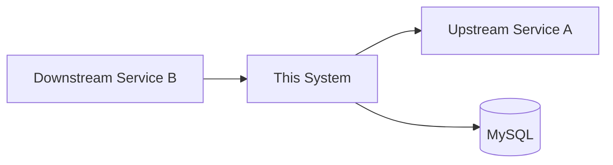

# 06_Topology

> [!TIP]
> **Purpose**: Describe the business boundaries of the project, upstream and downstream dependencies, and organizational mapping.

## 1. System Dependency Topology

## 2. Module Responsibilities List
- **Module A**: [Feature description]
- **Module B**: [Feature description]

## 3. Organization and Stakeholders
- **Commander**: [Contact/Role]
- **Business Expert**: [Contact/Role]
