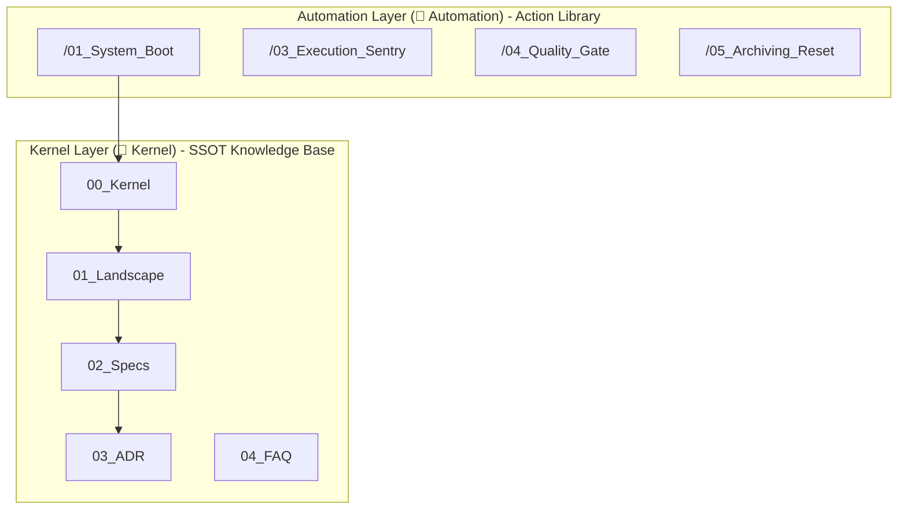

# 🗺️ Sentinel-K Universal Kernel Map

> **Positioning**: Architectural blueprint of the Sentinel-K "AI Collaborative OS".

## 1. Architecture Hierarchy



## 2. Standard Directory Layout

```text
Project Root/
├── .agent/
│   └── workflows/                # 🚀 [Automation Layer] (Logic)
│
├── Sentinel-K_Kernel/               # 🧠 [Knowledge Layer] (Kernel - SSOT)
│   ├── 00_Kernel.md                 # Core Laws (Constitution) `[K-TERM]`
│   ├── 01_Landscape.md              # Project Landscape Map (Domain Model)
│   ├── 02_Specs/                    # Frontend and Backend Development Specs
│   ├── 03_ADR.md                    # Architecture Decision Records `[K-ADR]`
│   ├── 04_FAQ.md                    # Knowledge Accumulation and Q&A
│   ├── 05_Tasks.md                  # Task Progress and Tracking
│   ├── 06_Topology.md               # Business Architecture and Org Relations
│   └── Kernel_Map.md                # This document
│
├── Project_Name/                    # 🏗️ [Execution Layer] (Body)
└── docs/                            # 🗄️ [Archive Layer] (Archive)
    └── prototypes/                  # Prototype Factory
```

## 3. Instruction Set Guide

1. **/01_System_Boot**: Load context according to `[K-BOOT]`, complete persona alignment.
2. **/02_Planning_Radar**: Start requirements audit, trigger `[K-PIZZA]` determination.
3. **/03_Execution_Sentry**: Execute according to `[K-LANG]` and `[K-TEST]`, deliver `[K-EVIDENCE]` block.
4. **/04_Quality_Gate**: Entropy detection, verify criteria loop.
5. **/05_Archiving_Reset**: Synchronize `[K-ADR]` and progress, reset Pack-0.

---
> *Updated on: 2026-02-16 - SSOT Path Unification*
